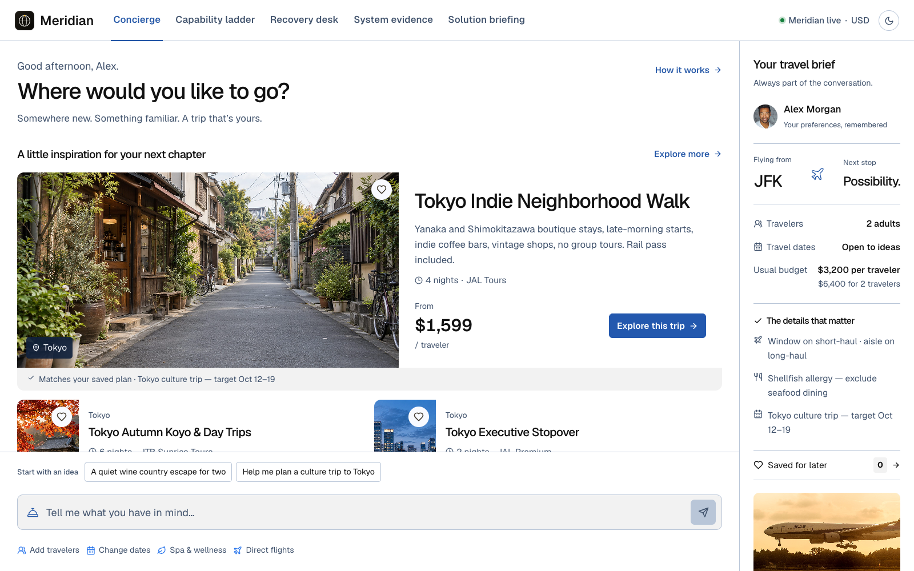

# Meridian - Plan. Fly. Land.

Reference application for **Build stateful agentic AI workflows with Aurora, MCP, and AgentCore**.

<p align="center">
  <a href="https://github.com/aws-samples/sample-stateful-agentic-ai-workflows-aurora-mcp-agentcore/actions/workflows/application-ci.yml"></a>
  <a href="LICENSE"></a>
  
  
  
  
  
</p>

Meridian is a realistic agentic travel concierge operating on live relational
data. It combines structured SQL, pgvector semantic retrieval, PostgreSQL
full-text search, and reranking with MCP tools, Strands Agents, Bedrock
AgentCore, and durable LangGraph workflows. Aurora-backed memory, row-level
security, audit trails, and checkpoints keep every turn governed and resilient.

> **Statefulness lives in durable stores, not database connections.** The RDS
> Data API is a connectionless transport for durable Aurora reads and writes;
> AgentCore Memory carries managed context across turns; and LangGraph
> PostgresSaver externalizes workflow execution state into Aurora through a
> bounded PostgreSQL connection pool.



<p align="center"><sub>Live Aurora results pair realistic trip cards with disruption recovery, traveler context, and inspectable system proof.</sub></p>

**[Quick start](#quick-start)** · **[Five-phase architecture](#what-it-demonstrates)** · **[Stateful architecture](meridian/docs/STATEFUL_ARCHITECTURE.md)** · **[Validation](#validation)** · **[Demo script](meridian/DEMO_SCRIPT.md)** · **[Presenter guide](meridian/docs/PRESENTER_GUIDE.md)**

## What It Demonstrates

Meridian walks one travel domain through five increasingly capable patterns
without hiding the implementation behind a generic chat interface:

| Phase | Adds | Live proof |
| ----- | ---- | ---------- |
| **1 · SQL** | Query | Parameterized filters over Aurora through the RDS Data API |
| **2 · MCP** | Governed tools | PostgreSQL MCP plus typed comparison, FX, loyalty, and availability tools |
| **3 · Retrieval** | Intent | Cohere Embed v4, pgvector, full-text search, and Cohere Rerank 3.5 |
| **4 · Production** | Trust | Workload identity, workload-to-traveler grants, RLS, and audit trails |
| **5 · Workflow** | Durability | PostgresSaver checkpoint, worker restart, and same-thread resume from Aurora |

The demo traveler is **Alex Morgan** (`trv_meridian_demo`), a JFK-based
Marriott Bonvoy Platinum Elite traveler. Production and Workflow use Alex's
Aurora-backed profile, preferences, conversational memory, and RLS scope only
after the authenticated workload has an active grant to Alex's traveler record.

The showcase exposes two synchronized views:

- **Experience** presents the personalized concierge, realistic recommendations,
  comparison, holds, saved trips, and a persistent journey workspace.
- **System proof** exposes tool spans, generated SQL, hybrid retrieval,
  memory reads and writes, authorization ALLOW/DENY decisions, RLS evidence,
  audit records, and checkpoints.

## Quick Start

The runnable application lives in [`meridian/`](meridian/).

### Backend

```bash
cd meridian
python -m venv venv
source venv/bin/activate
python -m pip install --require-hashes -r requirements.txt

cp .env.example .env
# Fill in Aurora cluster ARN, secret ARN, database, and AWS region.

# Fresh or disposable database only: rebuilds the base schema.
python scripts/init_aurora_schema.py
python scripts/seed_data.py

uvicorn backend.main:app --reload --port 8000
```

### Frontend

```bash
cd meridian/frontend
npm ci
npm run dev
```

Open [`http://localhost:5173/showcase`](http://localhost:5173/showcase). The
root route redirects to the showcase. For an existing database, do not rerun
`init_aurora_schema.py`; apply tracked upgrades with
`python scripts/apply_migrations.py`.

## Demo Surfaces

| Surface | Route | Purpose |
| ------- | ----- | ------- |
| Meridian Showcase | `/showcase` | Primary live experience and system-proof surface |
| Demo Stage | `/demo-stage`, `/stage` | Kiosk loop and presenter playback |

## Documentation

| Doc | Purpose |
| --- | ------- |
| [meridian/README.md](meridian/README.md) | Full setup, architecture, API, phase prompts, and validation |
| [meridian/DEMO_SCRIPT.md](meridian/DEMO_SCRIPT.md) | Extended demo script and optional code walkthrough |
| [meridian/docs/PRESENTER_GUIDE.md](meridian/docs/PRESENTER_GUIDE.md) | Concise run of show, claim boundaries, and readiness checklist |
| [meridian/docs/OPERATIONS.md](meridian/docs/OPERATIONS.md) | AgentCore deployment and day-of operations |
| [meridian/docs/STATEFUL_ARCHITECTURE.md](meridian/docs/STATEFUL_ARCHITECTURE.md) | Durable-state, transport, and checkpoint architecture |
| [CONTRIBUTING.md](CONTRIBUTING.md) | Contribution guidelines |

## Tech Stack

- **Frontend:** React, Vite, TypeScript
- **Backend:** FastAPI, Strands Agents, LangGraph
- **Models:** Claude Sonnet 5 on Amazon Bedrock, Cohere Embed v4, Cohere Rerank 3.5
- **Data:** Aurora PostgreSQL 18+, pgvector, RDS Data API, pooled psycopg, identity bindings, Row-Level Security
- **Protocols and services:** Model Context Protocol, Bedrock AgentCore Runtime, Gateway, Memory, and IAM or AgentCore workload identity

This sample authorizes AWS or AgentCore workload identities. A shared hosted
application must also authenticate its end users and bind the verified user
subject, such as a Cognito `sub`, to the traveler record. Apply your
organization's networking, observability, availability, and governance
requirements before production use.

## Validation

The GitHub Actions workflow runs backend, frontend, and AgentCore CDK checks on
every push to `main`. Run the same commands locally:

```bash
cd meridian
source venv/bin/activate
python -m pytest
python -m pip_audit -r requirements.txt
```

```bash
cd meridian/frontend
npm ci
npm run lint
npm run test:run
npm run build
npm audit --audit-level=high
```

```bash
cd meridian/meridian_agentcore/agentcore/cdk
npm ci
npm run build
npm test -- --runInBand
npm run format:check
```
