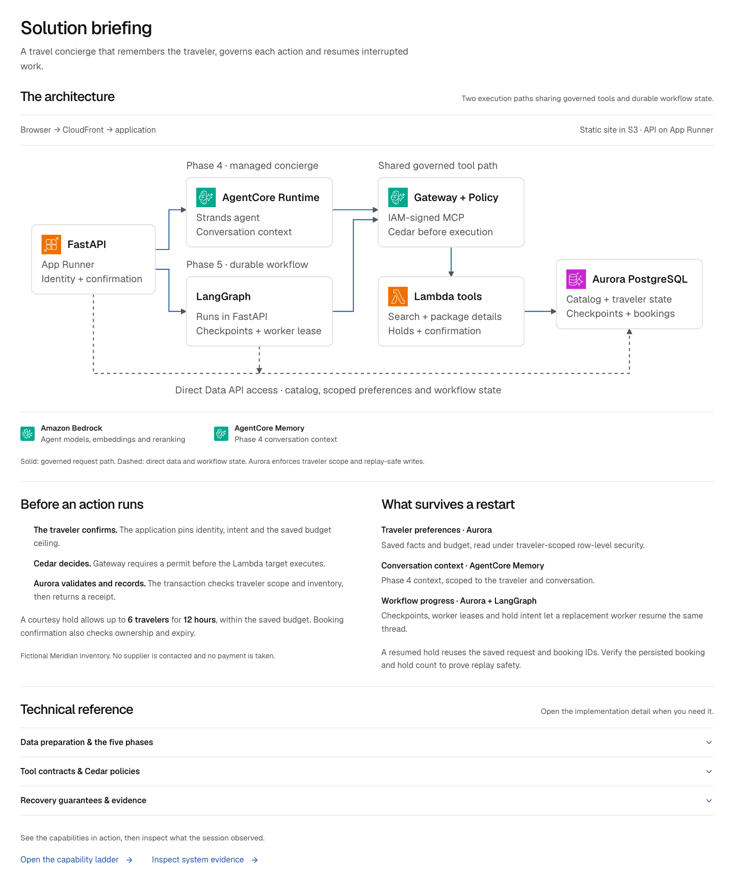

# Meridian - Plan. Fly. Land.

Reference application for **Build stateful agentic AI workflows with Aurora, MCP, and AgentCore**.

<p align="center">
  <a href="https://github.com/aws-samples/sample-stateful-agentic-ai-workflows-aurora-mcp-agentcore/actions/workflows/application-ci.yml"></a>
  <a href="LICENSE"></a>
  <a href="meridian/README.md#prerequisites"></a>
  <a href="meridian/README.md#prerequisites"></a>
</p>

<p align="center">
  <a href="#tech-stack"></a>
  <a href="#tech-stack"></a>
  <a href="#what-it-demonstrates"></a>
</p>

Meridian is a working travel concierge backed by Aurora PostgreSQL. Explore
trips, recall traveler preferences, and recover an interrupted trip-planning
workflow. Then inspect the SQL, tools, authorization decisions, and persisted
state behind the experience.

The application combines SQL, pgvector, PostgreSQL full-text search, and
reranking with MCP tools, Strands Agents, Bedrock AgentCore, and LangGraph.
The catalog contains sample travel packages; it is not a live airline booking
or ticketing feed.

> **Statefulness lives in durable stores, not database connections.** The RDS
> Data API is a connectionless transport for durable Aurora reads and writes;
> LangGraph checkpoints persist execution state in Aurora through the
> `AuroraDataApiSaver` or a pooled `AsyncPostgresSaver`. AgentCore Memory adds
> managed context when configured. The app reports which checkpoint backend
> actually served the run.


<p align="center"><sub>Captured September 12, 2026, from the local app in fullscreen presentation mode. Catalog and traveler details were read from Aurora. The screenshot does not represent a new booking or recovery execution.</sub></p>

**[Quick start](#quick-start)** · **[Five-phase architecture](#what-it-demonstrates)** · **[Stateful architecture](meridian/docs/STATEFUL_ARCHITECTURE.md)** · **[Validation](#validation)** · **[Demo script](meridian/DEMO_SCRIPT.md)** · **[Presenter guide](meridian/docs/PRESENTER_GUIDE.md)**

## What It Demonstrates

Meridian walks one travel domain through five increasingly capable patterns
without hiding the implementation behind a generic chat interface:

| Phase | Adds | Evidence to inspect |
| ----- | ---- | ---------- |
| **1 · SQL** | Query | Parameterized filters over Aurora through the RDS Data API |
| **2 · MCP** | Tool contracts | PostgreSQL MCP plus typed comparison, FX, loyalty, and availability tools |
| **3 · Retrieval** | Intent | Cohere Embed v4, pgvector, full-text search, and Cohere Rerank 3.5 |
| **4 · Production** | Governed agent actions with traveler context | AgentCore Runtime, Gateway policy decisions, authorized traveler reads under RLS, and booking receipts |
| **5 · Workflow** | Durability | Aurora checkpoints, worker leases, same-thread resume, and stable hold identity and expiry |

The demo traveler is **Alex Morgan** (`trv_meridian_demo`), a JFK-based
Marriott Bonvoy Platinum Elite traveler. Production and Workflow use Alex's
Aurora-backed profile, preferences, conversational memory, and RLS scope only
after the authenticated workload has an active grant to Alex's traveler record.

Five views cover the experience and its implementation. The talk follows
**Concierge → Capability ladder → Recovery desk → System evidence**;
**Solution briefing** explains prepared data, architecture, policy, and recovery.
The first four ladder phases pair a working query
with a boundary query that introduces the next capability. Workflow runs to
a checkpoint, then hands the same plan to the Recovery desk. These are
boundaries of this demo's configured phases, rather than limits of SQL or MCP.

From System evidence, **Session takeaways → Open for questions** closes the
talk with the traveler’s recovery outcome and three takeaways centered on
Aurora, AgentCore, and MCP + LangGraph, with a return to the same live evidence.
Hold receipts show the saved expiry and a countdown: 15 minutes for a recovery
workflow hold, or 12 hours for the separate trip-details action. The recovery
desk then carries the held package back to the concierge, where the traveler
confirms and the same governed chain turns the hold into a confirmed booking:
catalog inventory in Meridian's own database, no supplier and no payment. See the
[presenter guide](meridian/docs/PRESENTER_GUIDE.md#7-handoff-from-saved-progress-to-traveler-recovery)
for the handoff, hold policies, and closing script.

Every clicked hold uses the governed Runtime → Gateway → Lambda path, whatever
ladder phase is selected. Recovery hands the recorded duration, party, price,
and total back to Concierge. A policy permit, a saved checkpoint, and a
persisted booking are separate evidence.

Phase 3 specialists read the catalog and estimate prices. They cannot write a
booking; confirmation uses the governed flow.

Cedar is configured in the sample. [Dogwood temporal policy](meridian/docs/DOGWOOD_POLICY_ASSESSMENT.md)
is an assessed extension and is not enabled.

## Quick Start

The runnable application lives in [`meridian/`](meridian/). Start with an
existing configured Aurora database and AWS session. The
[full setup guide](meridian/README.md#prerequisites) covers prerequisites,
[new database preparation](meridian/README.md#prepare-a-new-demo-database),
and AgentCore configuration.

The laptop connects through the HTTPS RDS Data API. Keep Aurora private and
certificate verification enabled; this path does not need public PostgreSQL
ingress. Bind both local servers to `127.0.0.1`.

### Backend

```bash
cd meridian
python -m venv venv
source venv/bin/activate
python -m pip install --require-hashes -r requirements.txt

[ -f .env ] || cp .env.example .env
# Fill in Aurora cluster ARN, secret ARN, database, and AWS region.

LANGGRAPH_CHECKPOINT_DSN= LANGGRAPH_AUTO_CHECKPOINT_DSN=false \
LANGGRAPH_CHECKPOINT_DATA_API=true LANGGRAPH_CHECKPOINT_REQUIRED=true \
LANGGRAPH_CHECKPOINT_INIT_ON_STARTUP=true \
uvicorn backend.main:app --host 127.0.0.1 --port 8013
```

### Frontend

```bash
cd meridian/frontend
npm ci
VITE_API_ORIGIN=http://127.0.0.1:8013 npm run dev -- --host 127.0.0.1 --port 5176 --strictPort
```

Open `http://127.0.0.1:5176/showcase`. The root route redirects to the showcase.
If either port is occupied, choose a free port and keep `VITE_API_ORIGIN`
pointing to the backend. Database initialization and seeding are first-time
setup, not a health check for an existing journey.

Before demonstrating recovery, check `http://127.0.0.1:8013/health` for
`checkpoint_backend: "AuroraDataApiSaver"` and `checkpoint_durable: true`, then
confirm live trips and Alex’s profile load. Health reports process configuration;
catalog and profile reads verify the current AWS connection. The app offers
reconnect when those reads fail; readiness checks allow up to 45 seconds on
slower networks. `MemorySaver` cannot demonstrate recovery after
a worker restart. Phase 4, Phase 5 holds, and every clicked hold also require the
[configured AgentCore platform](meridian/docs/OPERATIONS.md#part-1--deploy-agentcore-day-before).

Use the [L300 runbook](meridian/DEMO_SCRIPT.md) for the pause/resume sequence,
three failure windows, and the distinction between process-death and
lost-response rehearsals. The [recovery rehearsal commands](meridian/README.md#rehearse-recovery-failures)
exercise both failures against isolated demo records. The [release review](meridian/docs/RELEASE_REVIEW.md)
records dated validation and its deployment boundaries.

### Publish behind CloudFront

For a shared screen without a laptop on stage, publish the same app to a
password-protected CloudFront URL. The CDK app in `meridian/infra/` puts the
Vite build in a private S3 bucket and runs the FastAPI backend as a container on
AWS App Runner, both behind one distribution. A CloudFront Function enforces
basic auth at the edge and injects the backend bearer token on `/api/*`, so the
App Runner URL itself refuses anonymous callers.

```bash
cd meridian
finch vm start                      # or Docker; the image is built locally
python scripts/publish.py           # secret, frontend build, cdk deploy, KeyValueStore
```

The script prints the URL and writes the basic-auth password and the bearer
token to `meridian/.local/published.json` (gitignored). Re-run it to redeploy.
See [OPERATIONS.md](meridian/docs/OPERATIONS.md#publish-behind-cloudfront) for
the details and teardown.

## Demo Surfaces

| Surface | Route | Purpose |
| ------- | ----- | ------- |
| Concierge | `/showcase?view=concierge` | Traveler discovery, conversation, preferences, and trip details |
| Capability ladder | `/showcase?view=ladder` | Five phases with boundary queries, architecture, and live traces |
| Recovery desk | `/showcase?view=recovery` | Canceled-trip scenario, saved shortlist, resume, package-hold receipt, and the handoff back to the concierge for confirmation |
| System evidence | `/showcase?view=proof` | Aurora readback of checkpoints, executions, authorization, and holds |
| Solution briefing | `/showcase?view=briefing` | Compact architecture, prepared-data flow, Cedar policies, failure windows, and expandable implementation detail |
| Demo Stage | `/demo-stage`, `/stage` | Kiosk loop and presenter playback |

In windowed mode, **Presenter controls** provides an audience preview,
projector readability, and fullscreen. Select **Present fullscreen**
before sharing: the controls and service sidebar disappear, while the five
views and their evidence remain accessible. **Esc** restores the controls.
Stop sharing before returning to windowed mode.

A saved shortlist and a package hold are separate events. The recovery receipt
shows the hold's database creation time, expiry, and remaining duration. A
worker restart must preserve the same booking ID and original 15-minute expiry.

<details>
<summary>See the current Solution briefing</summary>



Captured from the local application on September 12, 2026. The briefing explains
the configured design; System evidence reports what a journey actually observed.
The architecture uses the original SVG service icons from the July 31, 2026
AWS architecture deck, with their official colors and proportions preserved.
See the [application guide](meridian/README.md#screenshots) for prepared-data and
Recovery desk screenshots.

</details>

## Documentation

| Doc | Purpose |
| --- | ------- |
| [meridian/README.md](meridian/README.md) | Full setup, architecture, API, phase prompts, and validation |
| [meridian/DEMO_SCRIPT.md](meridian/DEMO_SCRIPT.md) | L300 chalk talk: 45 minutes of content, failure windows, and evidence |
| [meridian/docs/PRESENTER_GUIDE.md](meridian/docs/PRESENTER_GUIDE.md) | Concise run of show, claim boundaries, and readiness checklist |
| [meridian/docs/OPERATIONS.md](meridian/docs/OPERATIONS.md) | AgentCore deployment and day-of operations |
| [meridian/docs/STATEFUL_ARCHITECTURE.md](meridian/docs/STATEFUL_ARCHITECTURE.md) | Durable-state, transport, and checkpoint architecture |
| [meridian/docs/DOGWOOD_POLICY_ASSESSMENT.md](meridian/docs/DOGWOOD_POLICY_ASSESSMENT.md) | Temporal-policy proposal and required rehearsal; not enabled |
| [meridian/docs/RELEASE_REVIEW.md](meridian/docs/RELEASE_REVIEW.md) | Dated checks, live evidence, and deployment boundaries |
| [CONTRIBUTING.md](CONTRIBUTING.md) | Contribution guidelines |

## Tech Stack

- **Frontend:** React, Vite, TypeScript
- **Backend:** FastAPI, Strands Agents, LangGraph
- **Models:** Claude Sonnet 5 on Amazon Bedrock, Cohere Embed v4, Cohere Rerank 3.5
- **Data:** Aurora PostgreSQL, pgvector, RDS Data API, pooled psycopg, identity bindings, Row-Level Security
- **Protocols and services:** Model Context Protocol, Bedrock AgentCore Runtime, Gateway, Policy (Cedar), Memory, and Observability, with IAM or AgentCore workload identity

This sample authorizes AWS or AgentCore workload identities. A shared hosted
application must also authenticate its end users and bind the verified user
subject, such as a Cognito `sub`, to the traveler record. Apply your
organization's networking, observability, availability, and governance
requirements before production use.

## Validation

The GitHub Actions workflow runs backend, frontend, and AgentCore CDK checks on
every push to `main`. Run the same commands locally:

```bash
cd meridian
source venv/bin/activate
PYTHON_DOTENV_DISABLED=1 python -m pytest -m "not database"
ruff check backend scripts tests
python -m pip_audit -r requirements.txt
```

```bash
cd meridian/frontend
npm ci
npm run lint
npm run test:run
npm run build
npm audit --audit-level=high
```

```bash
cd meridian/meridian_agentcore/agentcore/cdk
npm ci
npm run build
npm test -- --runInBand
npm run format:check
npm audit --audit-level=high
```

Install `ruff` and `pip-audit` in the backend virtual environment before
running those checks. Non-database tests disable live checkpoint configuration
and reject unmocked network connections. The command above additionally prevents
local pytest from loading the demo's `.env` configuration.

Run the live Aurora integration tests separately from `meridian/` with
`python -m pytest -m database`. This loads `.env` and requires a disposable,
migrated Aurora test database with a seeded catalog and AWS access. These tests
write checkpoints, journeys, and holds. See the
[audit validation notes](meridian/docs/AUDIT_FIXES.md) for the tested restart
scenario and its limits.
