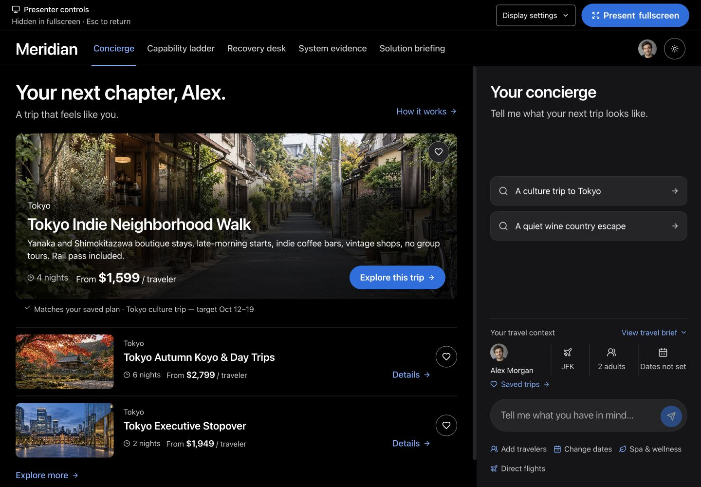

# Meridian: stateful agentic AI workflows with Aurora, MCP and AgentCore

<p align="center">
  <a href="https://github.com/aws-samples/sample-stateful-agentic-ai-workflows-aurora-mcp-agentcore/actions/workflows/application-ci.yml"></a>
  <a href="LICENSE"></a>
  <a href="#prerequisites"></a>
  <a href="#prerequisites"></a>
</p>

Meridian is a sample travel concierge that keeps its state in Amazon Aurora
PostgreSQL. It shows how an agentic application grows from SQL queries to MCP
tools, hybrid retrieval, a governed agent on Amazon Bedrock AgentCore, and a
LangGraph workflow that survives the loss of its worker process. Every screen
lets you inspect the SQL, tool calls, authorization decisions and stored
records behind the result.

The catalog holds sample travel packages and one fictional traveler, Alex
Morgan (`trv_meridian_demo`). Holds and confirmations change rows in Meridian's
own database only: there is no supplier, airline or payment integration.



## What it demonstrates

The application walks one travel domain through five phases. Each phase adds
one capability and keeps the ones before it.

| Phase | Adds | Implementation |
| --- | --- | --- |
| 1 · SQL | Grounded answers | Parameterized catalog filters over Aurora through the RDS Data API |
| 2 · MCP | Reusable tools | The PostgreSQL MCP server plus custom MCP tools for comparison, currency conversion, loyalty and availability |
| 3 · Retrieval | Search by meaning | Cohere Embed v4, pgvector and PostgreSQL full-text search, reranked by Cohere Rerank 3.5 |
| 4 · Production | Governed actions for a known traveler | A Strands agent on AgentCore Runtime, tools through AgentCore Gateway, Cedar policies, AgentCore Memory, and traveler-scoped reads under Aurora row-level security |
| 5 · Workflow | Durable execution | A LangGraph workflow with Aurora checkpoints, worker leases, and a hold that keeps its identity and expiry across a restart |

The sample separates three kinds of state and stores each durably:

- **Traveler context**: profile, preferences and conversation history in Aurora, and the agent's session in AgentCore Memory.
- **Workflow progress**: LangGraph checkpoints in Aurora, written through the RDS Data API (`AuroraDataApiSaver`) or a pooled PostgreSQL connection (`AsyncPostgresSaver`).
- **Business results**: holds and confirmed bookings in Aurora, written by one idempotent SQL function per action so a retried request returns the original result.

The RDS Data API is a connectionless HTTPS transport; the state lives in
Aurora tables, not in a database connection.

## Architecture

```text
Browser (React, Vite)
  └─ FastAPI backend ──────────────── Aurora PostgreSQL (RDS Data API)
       │  Phases 1-3: SQL, MCP servers, Bedrock embeddings and rerank
       │  Phase 5: LangGraph workflow, checkpoints in Aurora
       │
       └─ AgentCore Runtime (MeridianConcierge, Strands agent)
            ├─ AgentCore Memory (meridian_session)
            └─ AgentCore Gateway (meridian-aurora, MCP over SigV4)
                 ├─ Cedar policy engine (MeridianGovernance, ENFORCE)
                 ├─ SemanticTripSearchLambda ─── Aurora (pgvector search)
                 └─ MeridianHolds Lambda ─────── Aurora (hold and confirm functions)
```

Every hold and booking confirmation goes through the Gateway, whichever phase
started it. Cedar decides each tool call on its arguments before a Lambda runs:
a hold needs the traveler's confirmation, at most 12 hours, at most 6
travelers and a total within the traveler's saved budget. The backend, the
runtime and the holds Lambda each hold their own grant to the traveler in
Aurora, and row-level security limits every scoped query to that traveler.
[STATEFUL_ARCHITECTURE.md](meridian/docs/STATEFUL_ARCHITECTURE.md) covers the
state design, and [meridian/README.md](meridian/README.md) covers the API,
schema and configuration.

## Prerequisites

- Python 3.13 and Node.js 22.12 or later (Node.js 20.19 also works)
- An AWS account and credentials for it (`aws login`, `aws sso login` or `aws configure`)
- Amazon Bedrock access to `global.anthropic.claude-sonnet-5` (or another model you set in `BEDROCK_MODEL_ID`), Cohere Embed v4 and Cohere Rerank 3.5
- An Aurora PostgreSQL cluster with the RDS Data API enabled and a Secrets Manager secret for its database user. [OPERATIONS.md](meridian/docs/OPERATIONS.md#provision-aurora) shows how to create one with the included CDK app.
- For Phase 4, the Concierge chat, and every hold or confirmation: the AgentCore resources, deployed with the [AgentCore CLI](https://github.com/aws/agentcore-cli) (`npm install -g @aws/agentcore`) as described in the [deployment runbook](meridian/docs/AGENTCORE_DEPLOY_RUNBOOK.md)

## Quick start

These steps run the backend and frontend on your machine against Aurora in
your account. The backend reaches Aurora over the HTTPS Data API, so the
cluster can stay private.

### 1. Configure and prepare the database

```bash
cd meridian
python3.13 -m venv venv
source venv/bin/activate
python -m pip install --require-hashes -r requirements.txt

cp .env.example .env
# Set AWS_DEFAULT_REGION, AURORA_CLUSTER_ARN, AURORA_SECRET_ARN and AURORA_DATABASE.
```

For a new, empty database, create the schema, apply the migrations and load
the sample data. `seed_data.py` also grants your current AWS identity access
to the demo traveler.

```bash
python scripts/init_aurora_schema.py
python scripts/apply_migrations.py
python scripts/seed_data.py
```

Both `init_aurora_schema.py` and `seed_data.py` refuse to run against a
database that already has Meridian tables or data. For an existing database,
run only `python scripts/apply_migrations.py`.

### 2. Start the backend

```bash
export LANGGRAPH_CHECKPOINT_DATA_API=true
export LANGGRAPH_CHECKPOINT_REQUIRED=true
export LANGGRAPH_CHECKPOINT_INIT_ON_STARTUP=true
export LANGGRAPH_AUTO_CHECKPOINT_DSN=false
uvicorn backend.main:app --host 127.0.0.1 --port 8013
```

These settings store workflow checkpoints in Aurora through the Data API and
stop startup if that store is unavailable, instead of falling back to an
in-memory saver that cannot survive a restart.

Check the configuration:

```bash
curl http://127.0.0.1:8013/api/health
```

The response should include `"checkpoint_backend": "AuroraDataApiSaver"` and
`"checkpoint_durable": true`. Loopback requests are allowed without an API
token in development; see [meridian/README.md](meridian/README.md#governance-boundary)
before exposing the API to a network.

### 3. Start the frontend

```bash
cd meridian/frontend
npm ci
export VITE_API_ORIGIN=http://127.0.0.1:8013
npm run dev -- --host 127.0.0.1 --port 5176 --strictPort
```

Open <http://127.0.0.1:5176/showcase>. The header shows **Meridian live** once
the catalog and traveler reads succeed.

Without AgentCore resources, the catalog, Phases 1 to 3 of the Capability
ladder, System evidence and Solution briefing work. The Concierge chat,
Phase 4, and every hold or confirmation report that AgentCore is not
configured. Deploy AgentCore to enable them.

## Try the demo

The showcase has five views, selected along the top of the page.

1. **Concierge.** Browse trips for Alex and open one with **Explore this trip**
   or **Details**.
   Ask for something in the composer, for example
   `Find Tokyo trips that fit my saved preferences.` The answer uses Alex's
   saved preferences through the Phase 4 runtime. In a trip's details,
   **Request 12-hour hold** places a courtesy hold through the Gateway, and
   **Confirm this trip for Alex** confirms it.
2. **Capability ladder.** Pick a phase and run its suggested prompts. Each
   phase has two example prompts that work there and a hand-off prompt that
   needs the next phase. Phase 5 is the last phase, so its hand-off is
   `Resume workflow from checkpoint`, which resumes the paused run:

   | Phase | Works here | Hand-off |
   | --- | --- | --- |
   | SQL | `Show me city trips under $2,000 per traveler.`<br>`Show me beach trips under $2,500 per traveler.` | `Compare three trip types and convert each price to euros.` |
   | MCP | `Compare three trip types and convert each price to euros.`<br>`What is the off-season price range for Tokyo trips in November?` | `Find a quiet, romantic wine-country retreat with a private villa.` |
   | Retrieval | `Find a quiet, romantic wine-country retreat with a private villa.`<br>`Which trip lengths are still available for Tuscany Wine & Wellness?` | `Recall my Tokyo plan and saved preferences: home airport, food needs, and budget.` |
   | Production (turn on **Use traveler context** first) | `Find Tokyo trips that fit my saved preferences.`<br>`Recall my Tokyo plan and saved preferences: home airport, food needs, and budget.` | `My JFK-to-Tokyo flight was canceled. Rework the trip, then check duration availability for the best three options.` |
   | Workflow | `My JFK-to-Tokyo flight was canceled. Rework the trip, then check duration availability for the best three options.`<br>`Which trip lengths are still available for Amalfi Coast Villa Week?` | `Resume workflow from checkpoint` |

   Open the activity trace under each reply to see the SQL, tool calls,
   retrieval scores and policy decisions that produced it.
3. **Recovery desk.** The Workflow prompt pauses after its search step with a
   checkpoint in Aurora. Select **Continue at recovery desk**. To see the
   recovery, stop the backend with `Ctrl+C`, start it again with the same
   command, then select **Resume and request hold**. The workflow resumes from
   the saved checkpoint on the same thread and requests a 15-minute hold.
   **Take it back to Alex** carries the held trip to the Concierge for
   confirmation.
4. **System evidence.** Read back what Aurora recorded for the selected
   journey: checkpoints, worker executions and leases, authorization
   decisions, and the hold with its booking ID and expiry.
5. **Solution briefing.** The architecture, data preparation, the five phases,
   the gateway tools and the Cedar policies, without calling any service.

[OPERATIONS.md](meridian/docs/OPERATIONS.md#exercise-recovery-failures) lists
scripts that kill a worker or discard a committed response on purpose, and
shows what each one proves.

## Deploy

| Component | How | Guide |
| --- | --- | --- |
| Aurora cluster | CDK app `meridian/infra/bin/meridian-aurora.ts` | [OPERATIONS.md](meridian/docs/OPERATIONS.md#provision-aurora) |
| AgentCore Runtime, Gateway, Memory, policies | AgentCore CLI, from templates rendered for your account | [AGENTCORE_DEPLOY_RUNBOOK.md](meridian/docs/AGENTCORE_DEPLOY_RUNBOOK.md) |
| Hosted web app (CloudFront, S3, App Runner) | `meridian/scripts/publish.py`, for an existing App Runner service | [OPERATIONS.md](meridian/docs/OPERATIONS.md#publish-the-web-app) |

The AgentCore configuration is committed as templates with placeholders.
`python scripts/render_agentcore_config.py` fills in your account, Region,
Aurora ARNs and deployed resource IDs; the
[AgentCore project README](meridian/meridian_agentcore/README.md) explains how.

Resources in your account incur charges while they exist. Each guide ends with
teardown steps.

## Tests

The CI workflow in `.github/workflows/application-ci.yml` runs these checks on
every pull request and on pushes to `main`.

```bash
# Backend (from meridian/, with the virtual environment active)
python -m pip install ruff pip-audit
ruff check backend scripts tests meridian_agentcore/app meridian_agentcore/agentcore/gateway_targets
PYTHON_DOTENV_DISABLED=1 python -m pytest -m "not database"
python -m pip_audit -r requirements.txt

# Frontend (from meridian/frontend/)
npm ci && npm run lint && npm run typecheck && npm run test:run && npm run build

# AgentCore CDK app (from meridian/meridian_agentcore/agentcore/cdk/)
npm ci && npm run build && npm test -- --runInBand && npm run format:check

# Web infrastructure (from meridian/infra/)
npm ci && npm test
```

The backend unit tests block network access and ignore `meridian/.env`.
Tests marked `database` run against a live, migrated and seeded Aurora
database and write checkpoints, journeys and holds; run them with
`python -m pytest -m database` only against a disposable database.

## Repository map

| Path | Contents |
| --- | --- |
| [`meridian/backend/`](meridian/backend/) | FastAPI app: routers, the five phase agents, the Aurora Data API client, checkpoint saver and MCP servers |
| [`meridian/frontend/`](meridian/frontend/) | React showcase (`/showcase`) and kiosk playback surface (`/demo-stage`) |
| [`meridian/meridian_agentcore/`](meridian/meridian_agentcore/) | AgentCore CLI project: runtime code, gateway Lambda targets, config templates, CDK app |
| [`meridian/infra/`](meridian/infra/) | CDK apps for the Aurora cluster and the hosted web app |
| [`meridian/scripts/`](meridian/scripts/) | Schema, migration, seed, AgentCore render and sync, verification and recovery exercise scripts |
| [`meridian/examples/`](meridian/examples/) | Row-level security SQL and a stand-alone memory MCP client |
| [`meridian/tests/`](meridian/tests/) | Pytest suite, including a LangGraph checkpointer conformance suite |
| [`meridian/docs/`](meridian/docs/) | Architecture, operations, deployment runbook, code walkthrough and design notes |

[meridian/STRUCTURE.md](meridian/STRUCTURE.md) maps the request path through
the code.

## Security

This sample authorizes AWS workload identities, not people. Local development
and the hosted sample use one shared demo principal bound to Alex. An
application with real users must authenticate each user and bind the verified
user identity, such as an Amazon Cognito `sub`, to the traveler record. Review
networking, monitoring, availability and data-protection requirements before
using any part of this sample in production.

See [CONTRIBUTING](CONTRIBUTING.md#security-issue-notifications) for how to
report a security issue.

## License

This library is licensed under the MIT-0 License. See the [LICENSE](LICENSE) file.
