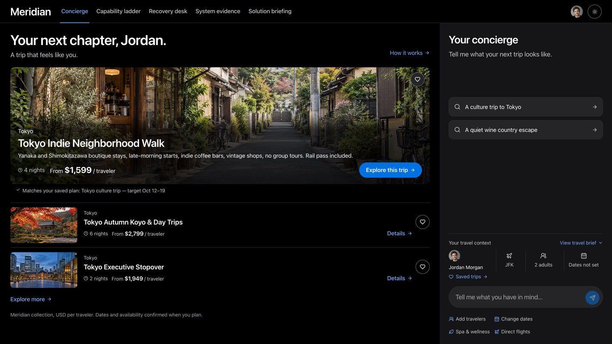

# Meridian: stateful agentic AI with Aurora, MCP and AgentCore

<p align="center">
  <a href="https://github.com/aws-samples/sample-stateful-agentic-ai-workflows-aurora-mcp-agentcore/actions/workflows/application-ci.yml"></a>
  <a href="LICENSE"></a>
  <a href="#prerequisites"></a>
  <a href="#prerequisites"></a>
</p>

Meridian is a sample travel concierge that stores its state in AWS Aurora
PostgreSQL. You learn how an agent application grows in five phases: from SQL
queries to Model Context Protocol (MCP) tools, hybrid retrieval, a governed
agent on Amazon Bedrock AgentCore, and a Strands Graph workflow in its own
AgentCore Runtime that resumes after its session stops. Every screen shows the SQL, tool calls, authorization
decisions and stored records behind each answer.

The data is sample travel packages and one fictional traveler, Jordan Morgan.
Holds and confirmations change rows in Meridian's own database only. There is
no supplier, airline or payment integration.



## What it demonstrates

Each phase adds one capability and keeps the earlier ones.

| Phase | Code | Adds |
| --- | --- | --- |
| 1. SQL | [phase_01_sql](meridian/backend/agents/phase_01_sql/) | Parameterized catalog queries through the RDS Data API |
| 2. MCP | [phase_02_mcp](meridian/backend/agents/phase_02_mcp/) | Named tools for search, comparison, currency conversion and availability |
| 3. Retrieval | [phase_03_retrieval](meridian/backend/agents/phase_03_retrieval/) | Cohere Embed v4, pgvector and full-text candidates, Cohere Rerank 3.5 |
| 4. Production | [phase_04_production](meridian/backend/agents/phase_04_production/) | AgentCore Runtime, Gateway, Memory and Cedar policy, with traveler grants and row-level security (RLS) in Aurora |
| 5. Workflow | [phase_05_workflow](meridian/backend/agents/phase_05_workflow/) | A Strands Graph in its own AgentCore Runtime, Aurora snapshots, worker leases and idempotent holds |

Each phase folder has a short guide with a sample prompt and the evidence to
inspect. The sample keeps three kinds of state in Aurora or AgentCore:

- **Traveler context:** profile, preferences and conversation history in Aurora. The agent session is in AgentCore Memory.
- **Workflow progress:** Strands Graph snapshots in the Aurora table `workflow_snapshots`, appended after every node.
- **Business results:** holds and bookings in Aurora. One idempotent SQL function handles each action, so a retried request returns the first result.

## Architecture

```text
Browser (React, Vite)
  └─ FastAPI backend ──────────────── Aurora PostgreSQL (RDS Data API)
       │  Phases 1-3: SQL, MCP servers, Bedrock embeddings and rerank
       │  Phase 5: invokes MeridianWorkflow, relays its result,
       │           holds the stop-session control
       │
       ├─ AgentCore Runtime (MeridianConcierge, Strands agent)
       │    ├─ AgentCore Memory
       │    └─ AgentCore Gateway (MCP over SigV4)
       │         ├─ Cedar policy engine (ENFORCE)
       │         ├─ SemanticTripSearchLambda ─── Aurora (pgvector search)
       │         └─ MeridianHolds Lambda ─────── Aurora (hold and confirm functions)
       │
       └─ AgentCore Runtime (MeridianWorkflow, Strands Graph)
            ├─ runs as the Aurora login meridian_workflow
            ├─ saves workflow_snapshots after every node
            └─ places its hold through the same Gateway and Cedar policies
```

Every hold and confirmation goes through the Gateway. Cedar checks each tool
call before a Lambda runs: the traveler must confirm, a hold lasts at most 12
hours for at most 6 travelers, and the total must fit the saved budget. Aurora
RLS limits each query to one traveler. Read
[STATEFUL_ARCHITECTURE.md](meridian/docs/STATEFUL_ARCHITECTURE.md) for the
state design and [meridian/README.md](meridian/README.md) for the API, schema
and configuration.

Models on Amazon Bedrock: GPT-6 Sol for the agents, Cohere Embed v4 for
embeddings and Cohere Rerank 3.5 for reranking. `BEDROCK_MODEL_ID` changes the
local Strands agents; the managed Concierge runtime's model is set in
`meridian/meridian_agentcore/agentcore/agentcore.template.json`.

## Prerequisites

- Python 3.13 and Node.js 22.12 or later
- An AWS account with credentials (`aws login`, `aws sso login` or `aws configure`)
- Amazon Bedrock access to GPT-6 Sol, Cohere Embed v4 and Cohere Rerank 3.5
- An Aurora PostgreSQL cluster with the RDS Data API enabled and a Secrets Manager secret for the database user. [OPERATIONS.md](meridian/docs/OPERATIONS.md#provision-aurora) shows how to create one with the included CDK app.
- For Phase 4, the Concierge chat and all holds: AgentCore resources, deployed with the [AgentCore CLI](https://github.com/aws/agentcore-cli) (`npm install -g @aws/agentcore`). See the [deployment runbook](meridian/docs/AGENTCORE_DEPLOY_RUNBOOK.md).

## Quick start

These steps run the backend and frontend on your machine against Aurora in your
account. Resources in your account incur charges while they exist.

### 1. Configure and prepare the database

```bash
cd meridian
python3.13 -m venv venv
source venv/bin/activate
python -m pip install --require-hashes -r requirements.txt
cp .env.example .env
```

In `.env`, set `AWS_DEFAULT_REGION`, `AURORA_CLUSTER_ARN`, `AURORA_SECRET_ARN`
and `AURORA_DATABASE`. For a new, empty database, run:

```bash
python scripts/init_aurora_schema.py
python scripts/apply_migrations.py
python scripts/seed_data.py
```

`init_aurora_schema.py` and `seed_data.py` refuse to run if Meridian tables or
data already exist. For an existing database, run only `apply_migrations.py`.

### 2. Start the backend

```bash
uvicorn backend.main:app --host 127.0.0.1 --port 8013
```

Phase 5 runs in the `MeridianWorkflow` AgentCore Runtime, not in this process.
The backend invokes it through `AGENTCORE_WORKFLOW_RUNTIME_ARN`, which
`python scripts/sync_agentcore_env.py --write` sets after you deploy. The
Runtime connects to Aurora as the `meridian_workflow` login created by
`scripts/provision_workflow_login.py`. See the
[deployment runbook](meridian/docs/AGENTCORE_DEPLOY_RUNBOOK.md). Check the
backend:

```bash
curl http://127.0.0.1:8013/api/health
```

The response should include `"checkpoint_backend": "Aurora workflow_snapshots"`,
`"checkpoint_durable": true` and `"workflow_runtime_configured": true`. Local requests need no API token. Read the
[governance boundary](meridian/README.md#governance-boundary) before you expose
the API to a network.

### 3. Start the frontend

In a second terminal, from the repository root:

```bash
cd meridian/frontend
npm ci
export VITE_API_ORIGIN=http://127.0.0.1:8013
npm run dev -- --host 127.0.0.1 --port 5176 --strictPort
```

Open <http://127.0.0.1:5176/showcase>. The header shows **Meridian live** when
`/api/health` reports healthy and the catalog and traveler profile reads work.

Without AgentCore resources, the catalog, Phases 1 to 3, System evidence and
Solution briefing work. The Concierge chat, Phases 4 and 5 and all holds report
that AgentCore is not configured.

## Try the reference app

The showcase has five views along the top of the page.

1. **Concierge:** browse trips for Jordan and ask, for example,
   `Find Tokyo trips that fit my saved preferences.` Open a trip, then use
   **Request 12-hour hold** and **Confirm this trip for Jordan**.
2. **Capability ladder:** pick a phase and run its suggested prompts. Open the
   activity trace under a reply to see the SQL, tool calls, retrieval scores and
   policy decisions. Turn on **Use traveler context** for Phase 4.
3. **Recovery desk:** run the Phase 5 prompt
   `My JFK-to-Tokyo flight was canceled. Rework the trip, then check duration availability for the best three options.`
   The workflow pauses after a saved step, with a snapshot in Aurora. Select
   **Continue at recovery desk**, choose **Stop runtime session** on the
   continuity rail, then select **Resume and request hold**. The next resume
   starts a new microVM on the same session and continues on the same thread.
4. **System evidence:** read what Aurora recorded: snapshots, leases,
   session stops, authorization decisions and the hold.
5. **Solution briefing:** the architecture, phases, Gateway tools and Cedar
   policies. It calls no service.

The full prompt list for each phase is in [meridian/README.md](meridian/README.md#prompts).
[OPERATIONS.md](meridian/docs/OPERATIONS.md#exercise-recovery-failures) has
scripts that stop a worker or discard a response on purpose.

## Deploy

| Component | How | Guide |
| --- | --- | --- |
| Aurora cluster | CDK app `meridian/infra/bin/meridian-aurora.ts` | [OPERATIONS.md](meridian/docs/OPERATIONS.md#provision-aurora) |
| AgentCore Runtime, Gateway, Memory, policies | AgentCore CLI, from templates rendered for your account | [AGENTCORE_DEPLOY_RUNBOOK.md](meridian/docs/AGENTCORE_DEPLOY_RUNBOOK.md) |
| Hosted web app (CloudFront, S3, App Runner) | `meridian/scripts/publish.py`, for an existing App Runner service | [OPERATIONS.md](meridian/docs/OPERATIONS.md#publish-the-web-app) |

The AgentCore configuration is stored as templates with placeholders.
`python scripts/render_agentcore_config.py` fills in your account, Region and
resource IDs. See the [AgentCore project README](meridian/meridian_agentcore/README.md).
Each guide ends with teardown steps.

## Tests

```bash
# Backend (from meridian/, virtual environment active)
PYTHON_DOTENV_DISABLED=1 python -m pytest -m "not database"

# Frontend (from meridian/frontend/)
npm ci && npm run lint && npm run typecheck && npm run test:run
```

On every pull request CI runs ruff, the backend unit tests and `pip-audit`; the
frontend lint, typecheck, unit tests, build, `npm audit` and Playwright
accessibility tests; a backend container build with a network-less MCP import
check; the AgentCore CDK build, tests, format check and audit; and the web
infrastructure tests and audit. See [`application-ci.yml`](.github/workflows/application-ci.yml).

The unit tests block network access and ignore `meridian/.env`. Tests marked
`database` write snapshots, journeys and holds to a live Aurora database. Run
`python -m pytest -m database` only against a disposable database. See the
[dependency notes](meridian/docs/DEPENDENCIES.md) for the open audit finding.

## Repository map

| Path | Contents |
| --- | --- |
| [`meridian/backend/`](meridian/backend/) | FastAPI app, phase agents, Aurora client, MCP servers |
| [`meridian/frontend/`](meridian/frontend/) | React showcase |
| [`meridian/meridian_agentcore/`](meridian/meridian_agentcore/) | AgentCore project: runtime code, Gateway Lambdas, templates, CDK app |
| [`meridian/infra/`](meridian/infra/) | CDK apps for Aurora and the hosted web app |
| [`meridian/scripts/`](meridian/scripts/README.md) | Schema, seed, migration, AgentCore and recovery scripts |
| [`meridian/examples/langgraph/`](meridian/examples/langgraph/) | The maintained LangGraph example. The application does not import it |
| [`meridian/tests/`](meridian/tests/) | Pytest suite |
| [`meridian/docs/`](meridian/docs/README.md) | Architecture, operations and runbooks |

[meridian/STRUCTURE.md](meridian/STRUCTURE.md) traces a request through the code.

## Security

This sample authorizes AWS workload identities, not people. Local development
and the hosted sample use one shared principal bound to Jordan. An
application with real users must authenticate each user and bind the verified
identity, such as an Amazon Cognito `sub`, to the traveler record. Review
networking, monitoring, availability and data protection before any production
use. To report a security issue, see
[CONTRIBUTING](CONTRIBUTING.md#security-issue-notifications).

## License

This library is licensed under the MIT-0 License. See the [LICENSE](LICENSE) file.
