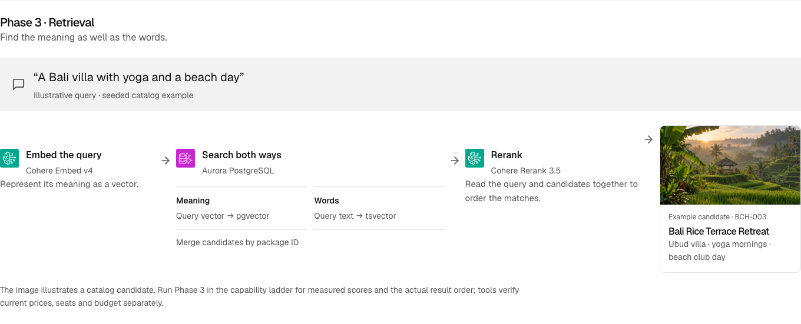
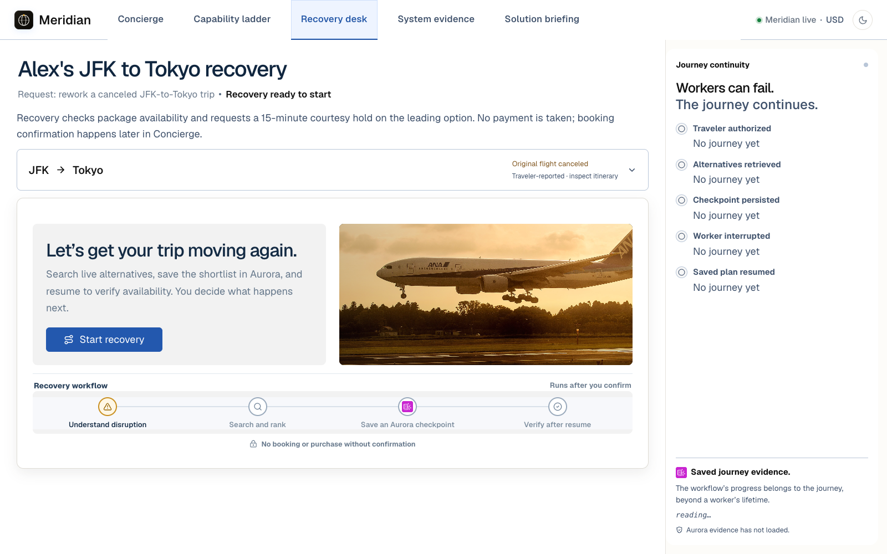

# Meridian — Plan. Fly. Land.

> Agentic travel concierge built on Aurora PostgreSQL, MCP, Strands Agents, Bedrock AgentCore, and LangGraph.

Meridian is a working travel concierge and L300 chalk-talk application for
**SQL → MCP → Retrieval → Production → Workflow**. The main walkthrough follows
**Concierge → Capability ladder → Recovery desk → System evidence**.
The fifth view, **Solution briefing**, leads with an always-visible architecture,
source-to-store data preparation, and five compact phase diagrams. Phase 3 shows
hybrid retrieval with a query, service icons, and an illustrative Bali destination
candidate. Three technical references hold implementation details, tool contracts,
Cedar policies, and recovery evidence. It has no nested tabs or diagram modes.
The 60-minute session budgets **40 minutes for slides, source walkthrough, and
live demonstration**, plus 20 minutes for discussion and operational flex.
The briefing hides the traveler sidebar for reading and uses a vertical
architecture flow on narrow screens. See the [visual walkthrough review](docs/BRIEFING_VISUALS_2026-09-20.md).
Domain-data operations use the RDS Data API. LangGraph persists workflow
checkpoints in Aurora through `AuroraDataApiSaver` or a pooled
`AsyncPostgresSaver`; AgentCore Memory supplies conversation context.

> **Statefulness lives in durable stores, not database connections.**

The primary demo surface is:

```text
http://127.0.0.1:5176/showcase
```

The root route redirects to `/showcase`.


Captured September 12, 2026, from the local app in fullscreen presentation mode,
with catalog and traveler data read from Aurora. The screenshots illustrate
sample inventory and the interface; they do not establish a new booking,
policy decision, or recovery execution.

## Prerequisites

For the current presentation, use the [editable deck and notes](docs/presentation/README.md),
[presenter runbook](docs/PRESENTER_RUNBOOK_2026-09-20.md), and [deployment follow-up](docs/FOLLOWUP_2026-09-20.md).

- Python 3.13 (the version CI builds and tests against)
- Node.js 22.12+ recommended (CI uses Node 22); Node 20.19+ is also supported
- AWS credentials with Amazon Bedrock and RDS Data API access
- Aurora PostgreSQL with pgvector and the RDS Data API enabled
- Access to the configured Bedrock models: the default is `global.anthropic.claude-sonnet-5`, with Cohere Embed v4 and Cohere Rerank 3.5 for retrieval
- A configured AgentCore Runtime, Gateway, Policy engine, and Memory for Phase 4, Phase 5 holds, and every clicked hold; see [Operations](docs/OPERATIONS.md#part-1--deploy-agentcore-day-before)

## Quick Start

### Backend

Use the existing prepared Aurora database. For a new database, complete
[data preparation](#prepare-a-new-demo-database) before starting the app.

```bash
cd meridian
python -m venv venv
source venv/bin/activate
python -m pip install --upgrade pip
python -m pip install --require-hashes -r requirements.txt

[ -f .env ] || cp .env.example .env
# Fill in AURORA_CLUSTER_ARN, AURORA_SECRET_ARN, AURORA_DATABASE, and AWS region.

LANGGRAPH_CHECKPOINT_DSN= LANGGRAPH_AUTO_CHECKPOINT_DSN=false \
LANGGRAPH_CHECKPOINT_DATA_API=true LANGGRAPH_CHECKPOINT_REQUIRED=true \
LANGGRAPH_CHECKPOINT_INIT_ON_STARTUP=true \
uvicorn backend.main:app --host 127.0.0.1 --port 8013
```

Read the configured backend health:

```bash
curl --fail http://127.0.0.1:8013/api/health
```

Expected result: `{"status":"healthy", ...}`.
This route requires HTTP authentication outside permitted loopback development.
Public `/health` exposes only `{"status":"healthy"}` and cannot establish
Aurora connectivity or checkpoint durability.

For the Data API recovery demonstration, also verify
`checkpoint_backend: "AuroraDataApiSaver"` and `checkpoint_durable: true`.
The command explicitly selects Data API checkpointing. A separately configured
checkpoint DSN can select `AsyncPostgresSaver` over an existing private connection.
`LANGGRAPH_CHECKPOINT_REQUIRED=true` prevents startup from silently falling
back to in-process checkpoints when the durable store is unavailable.

Keep Aurora private and certificate verification enabled. The HTTPS Data API
path requires no public PostgreSQL ingress or security-group change.
Health reports process configuration; also confirm catalog and traveler reads
succeed and the app shows **Meridian live**. **Reconnect** retries those reads.
Readiness checks allow up to 45 seconds; periodic polling waits for an active
check to finish.
After renewing an expired AWS session, restart the backend if its clients still
use the expired session.
After updating the source, restart an existing backend so its routes match the
updated frontend, including the hold and booking readback endpoints.

`requirements.in` is the human-maintained dependency specification.
`requirements.txt` is the hash-pinned lock. It includes PostgreSQL MCP server
1.0.9 and the compatible MCP 1.x SDK. Both Phase 2 clients launch that installed
module with the active Python interpreter; no package download occurs during a
request. The supported connection is Aurora PostgreSQL through RDS Data API,
with both configured cluster and secret ARNs required at startup.

Maintainers can regenerate the lock with `uv` installed:

```bash
uv pip compile --generate-hashes --output-file requirements.txt requirements.in
```

### Frontend

```bash
cd meridian/frontend
npm ci
VITE_API_ORIGIN=http://127.0.0.1:8013 npm run dev -- --host 127.0.0.1 --port 5176 --strictPort
```

Open:

```text
http://127.0.0.1:5176/showcase
```

If a port is occupied, choose a free port and update `VITE_API_ORIGIN` to match
the backend. The showcase requires the backend and Aurora. Memory facts, trace
spans, RLS proof, and trip results come from API calls. Solution briefing is an
implementation guide; System evidence reads the selected journey's records.

### Prepare a new demo database

Run this only against a new or disposable demo database. Initialization
creates the base schema; both initialization and full seeding refuse existing
tables or data. Seeding creates sample data and grants the current
AWS workload access to Alex.

```bash
# From meridian/, with the virtual environment and AWS configuration ready:
python scripts/init_aurora_schema.py
python scripts/apply_migrations.py
python scripts/seed_data.py
```

For an existing database, preserve its journeys and bookings. Review and apply
tracked upgrades with `python scripts/apply_migrations.py`; do not reinitialize
or reseed it as a connectivity check. Existing databases that predate traveler
bindings may need `python scripts/bind_current_identity.py`. The backend,
Runtime, and Gateway Lambda have separate workload grants; follow
[Operations](docs/OPERATIONS.md) for the deployed roles.

For the pause/resume demonstration, set
`LANGGRAPH_DEMO_INTERRUPT_AFTER=search` before starting the backend. Use the
[L300 runbook](DEMO_SCRIPT.md) for the exact sequence and expected evidence.

### Publish behind CloudFront

Use the account-bound publisher for an **existing** deployment. It builds and
shows the CDK diff by default; `--apply` executes it. App Runner resolves the
origin token from Secrets Manager. Edge credentials are preserved.

```bash
cd meridian
python scripts/publish.py --account <account-id> --region us-east-1 --service-arn <existing-service-arn>
# After reviewing the plan, repeat with --apply.
```

The non-secret release receipt is `.local/hosted-release.json`. Read the
[deployment and verification runbook](docs/DEPLOYMENT_FOLLOWUP.md) for runtime secret references,
authenticated validation, new-account limitations and rollback.

The App Runner instance role is a workload like the gateway Lambda, so it needs
its own grant before it can set a traveler scope. Run this once after the roles
stack exists, or every Phase 4 and Phase 5 request on the published site fails
with `aws_iam subject is not authorized for traveler`:

```bash
python scripts/bind_web_backend_role.py
```

A confirmed booking consumes catalog capacity. Use dedicated rehearsal inventory.
For deliberate cleanup, first inspect what the release script would change:

```bash
python scripts/release_demo_bookings.py --dry-run
```

Release only the intended rehearsal records; cleanup is not a startup step.
See [Operations](docs/OPERATIONS.md#publish-behind-cloudfront) for publication.
A Git push does not deploy the hosted app or AgentCore resources. Tear down with
`cd infra && npx cdk destroy MeridianWeb`, delete the App Runner service
`meridian-web`, then `npx cdk destroy MeridianWebBackend MeridianWebRoles`.
The container starts through `backend/launch.py`, which opens the port before
the application loads; see `docs/AGENTCORE_LEARNINGS.md` for why.

## Demo Surfaces

| Surface | Route | Use |
| ------- | ----- | --- |
| **Concierge** | `/showcase?view=concierge` | Personalized discovery, conversation, trip details, saved trips, and traveler brief |
| **Capability ladder** | `/showcase?view=ladder` | Five phases, boundary queries, architecture disclosure, and live evidence |
| **Recovery desk** | `/showcase?view=recovery` | Canceled-trip scenario, checkpointed shortlist, resume, package-hold receipt, and the handoff that carries the held package back to the concierge for the traveler's confirmation |
| **System evidence** | `/showcase?view=proof` | Readback of the selected journey's checkpoints, execution leases, authorization, and holds |
| **Solution briefing** | `/showcase?view=briefing` | Architecture, visible data preparation, five phase diagrams and a hybrid-search example; three expandable references, no nested tabs |
| **Demo Stage** | `/demo-stage`, `/stage` | Kiosk loop and presenter playback surface |

`/showcase` opens Concierge; `/device-showcase` remains an alias. The selected
view and journey stay in the URL so refresh can restore the saved workflow.
The thread address is allocated before a recovery starts. Opening Recovery desk
does not adopt unrelated SQL results or the latest historical journey; use
**Open a saved recovery** to choose a stored run.

Concierge and the capability ladder use compact, right-aligned traveler messages
and open assistant replies aligned with the composer. Reply text keeps a readable
line length; trip results can fill the conversation column. The shared composer
expands for multiline requests: **Enter** sends and **Shift+Enter** adds a line.
Activity presents one expandable trace, inspired by Onward: each step shows its
recorded status and AWS service icons, with its events and technical payloads
available on expansion. **Inspect evidence** holds SQL, memory, policy checks,
and phase-specific diagnostics. It opens directly to recorded evidence and hides
unavailable views. **Run RLS probe** explicitly starts the live diagnostic.
The panel waits for returned evidence before
showing step progress. Compact ladder headings and query suggestions preserve
space for the conversation.

### Screenshots

The briefing capture uses the reviewed local application in the light theme on
September 20, 2026. The Recovery desk capture is from September 12 at a
1600 × 1000 fullscreen viewport, before starting a workflow. These are actual
interface captures, not generated mockups; the briefing itself makes no service calls.

<details>
<summary>Solution briefing: architecture and boundaries</summary>


The architecture uses original SVG service icons from the July 31, 2026
AWS architecture deck. The [asset provenance](frontend/public/brand/aws-2026-07-31/README.md)
records the source slides and files. The diagram preserves their official
colors and proportions in both themes.



The example uses a seeded catalog photograph. It explains vector and full-text
search, candidate deduplication by package ID, and reranking; it does not claim a
live score or result position. Run the capability ladder for observed results.

</details>

<details>
<summary>Recovery desk: the next action and its hold policy</summary>



</details>

### Presenting on a shared screen

The windowed **Presenter controls** bar contains **Preview audience layout**,
**Projector readability** and **Present fullscreen**. Preview
widens the workspace while leaving the preparation controls available. Projector
readability increases type size and secondary-text contrast in both themes.

Select **Present fullscreen** before sharing. The entire preparation bar,
and the service sidebar disappear. The
Meridian brand, surface navigation, conversation, and evidence remain available.
Press **Esc** to restore the windowed layout and your preparation choices.
Controls are visible on a shared windowed screen, so stop sharing first.

## Five-Phase Demo Ladder

| Phase | Capability | What the audience should see |
| ----- | ---------- | ---------------------------- |
| **1 · SQL** | Query | Direct Aurora rows returned through RDS Data API filters |
| **2 · MCP** | Tool | Aurora access through MCP plus custom domain tools such as package comparison, FX conversion, and seasonal pricing |
| **3 · Retrieval** | Intent | Hybrid pgvector + full-text candidates reranked by Cohere, with specialist-agent routing |
| **4 · Production** | Trust | AgentCore Runtime discovers four Gateway tools; Cedar decides whether the target may run; traveler grants and RLS scope the data; hold and booking receipts establish the business result |
| **5 · Workflow** | Durable Workflow | Aurora checkpoint, process restart, same-thread resume, and preserved hold identity and expiry |

### Where state lives

| State | Durable store | Access path |
| --- | --- | --- |
| Traveler profile, preferences, conversation history, and audit | Aurora PostgreSQL | RDS Data API |
| Managed session and semantic context across turns, when configured | Bedrock AgentCore Memory | AgentCore APIs |
| LangGraph execution position and pending writes | Aurora PostgreSQL | `AuroraDataApiSaver` over RDS Data API, or `AsyncPostgresSaver` over pooled psycopg |
| Journey binding, worker leases, and hold-request identities | Aurora PostgreSQL | Scoped RDS Data API transactions |
| Clicked holds in any phase and automatic Phase 5 holds | Aurora PostgreSQL | AgentCore Gateway tool, Cedar policy, then the `MeridianHolds` Lambda in one scoped Data API transaction |
| Booking confirmation | Aurora PostgreSQL | AgentCore Gateway tool, Cedar policy, then the `MeridianHolds` Lambda turning the held booking row into `confirmed`; catalog inventory only, no supplier, no payment |

MCP defines the tool contract. Gateway Policy supplies authorization for the
governed actions. A Data API
transaction keeps RLS role and traveler scope together for one unit of work; it
is not long-lived workflow state.

Phase 3's Booking Agent only calculates price estimates. Neither its tool
registry nor the reference SQL agent exposes a booking writer. Model-selected
write actions at the retrieval supervisor are refused and directed to the
governed confirmation flow.

## Prompt Ladder

The visible pills pair a working query with a boundary that motivates the next
phase. **Continue in…** carries the question forward. These are boundaries of
the configured demo phases, not inherent limitations of SQL or MCP. Additional
working queries are in [DEMO_SCRIPT.md](DEMO_SCRIPT.md).

| Phase | Works here | Next capability or proof |
| ----- | ------------------ | ------------- |
| SQL | `Show me city trips under $2,000 per traveler.` | `Compare three trip types and convert each price to euros.` → MCP |
| MCP | `Compare three trip types and convert each price to euros.` | `Find a quiet, romantic wine-country retreat with a private villa.` → Retrieval |
| Retrieval | `Find a quiet, romantic wine-country retreat with a private villa.` | `Recall my Tokyo plan and saved preferences: home airport, food needs, and budget.` → Production |
| Production | `Find Tokyo trips that fit my saved preferences.` | `My JFK-to-Tokyo flight was canceled. Rework the trip, then check duration availability for the best three options.` → Workflow |
| Workflow | `My JFK-to-Tokyo flight was canceled. Rework the trip, then check duration availability for the best three options.` | `Resume workflow from checkpoint` after the pause |

Phase 4's **Use traveler context** switch applies to availability questions as
well as recall and planning. With context off, the turn stops before reading or
writing traveler memory. With it on, the request goes through managed Runtime
and Gateway rather than a local availability shortcut.

### What recovery proves

The canceled itinerary is a preview and is not valid for boarding. Saving a
shortlist does not hold inventory. Once the workflow creates a package hold,
its receipt displays the creation time, original 15-minute expiry, and remaining
time. Restart verification checks that the same request produces one booking
with the same expiry, and that a replacement execution successfully resumes the
saved checkpoint. A second worker attempt alone is not proof of success.

Select **Continue at recovery desk**, then **Resume and request hold** to resume
the saved workflow and request its 15-minute hold. Booking confirmation is a
separate traveler action. **Take it back to Alex** carries a matching persisted
receipt into Concierge, preserving the recorded duration, party, unit price,
and total even if the catalog changes.

Refresh restores the saved thread, shortlist, traveler count, and resume action.
The workflow's closing response uses saved state directly, including the hold
outcome and expiry, without another model rewrite. Recalled preferences remain
context to review; their presence does not prove a package meets every preference.
System evidence distinguishes observed records, expired leases, completed holds,
and unavailable evidence. Failed refreshes label retained observations; selecting
a different journey clears the old evidence. Full checkpoint readback has a
60-second limit, with bounded concurrent blob reads to reduce service round trips.

Use [DEMO_SCRIPT.md](DEMO_SCRIPT.md#4-recovery-spend-time-at-the-failure-windows)
to distinguish failure before a write, after the business commit but before
checkpointing, and after the hold checkpoint. The hard-kill script exercises
the last window; it does not inject a lost Gateway response. A checkpoint and
a business write are separate transactions, so this is retry-safe business
behavior, not exactly-once execution. See the dated
[release review](docs/RELEASE_REVIEW.md) for checks performed and remaining rehearsal.

### Slow responses, direct holds, and browser reload

The browser limits chat, hold, and confirmation waits to **55 seconds**, including
response-body reads. The UI shows elapsed waiting and **Stop waiting**. The
managed Runtime SDK disables blanket retries and uses a 45-second socket read
timeout; that is not an end-to-end workflow deadline. Unconfirmed chat turns
without a hold or booking target get one retry if the connection closes before
response headers arrive. Confirmed writes, timeouts and failures after streaming
starts are never automatically replayed. A server action may finish after the
browser has stopped waiting.

- For an uncertain recovery outcome, use **Re-read this recovery** before resuming
  the same thread. Duplicate starts cannot overwrite its checkpoint.
- Before a direct 12-hour hold is sent, the browser saves its intent ID and terms.
  Reload or retry reads that exact intent under the authenticated traveler's RLS
  scope. A failed read does not start a speculative write.
- Booking confirmation first reads the persisted booking. An already-confirmed
  result restores its receipt without submitting confirmation again.
- Browser storage holds intent/booking references per traveler on that origin,
  not receipt truth. The database supplies recorded prices, party, status, and
  expiry with explicit UTC offsets. Keep storage intact while reconciling an
  uncertain action; unavailable storage blocks a new direct hold.

See the [September 17 hardening report](docs/CODE_HARDENING_2026-09-17.md) for
regression coverage, live lost-response proof, and the unresolved intermittent
lease-timeout observation. Validate latency again on the presentation network.

### Rehearse recovery failures

From `meridian/`, use the existing configured Aurora database and Gateway.
These scripts create their own journey, checkpoint, and hold records, then
remove them. They do not reset the catalog or release other bookings.

```bash
source venv/bin/activate
export LANGGRAPH_CHECKPOINT_DSN=
export LANGGRAPH_AUTO_CHECKPOINT_DSN=false
export LANGGRAPH_CHECKPOINT_DATA_API=true
export LANGGRAPH_CHECKPOINT_REQUIRED=true
python scripts/kill_and_resume_demo.py
python scripts/lost_response_demo.py
```

The first script kills a worker after the hold checkpoint. The second discards
a real Gateway hold acknowledgement at the worker and injects a timeout before
the hold node can checkpoint it. Aurora and Gateway calls remain real; the
response loss is deliberately simulated.

Expected results: a replacement worker resumes the saved intent, one hold
remains, and its request ID, booking ID, and original expiry are unchanged.
The lost-response script also verifies Cedar denies unconfirmed and over-budget
calls using that same request identity. Unknown Gateway outcomes fail the node
and leave it resumable; they do not finish the graph as an unheld plan.

## Architecture

```text
meridian/
├── backend/
│   ├── main.py
│   ├── routers/              # chat, packages, memory, diagnostics
│   ├── agents/
│   │   ├── sql_01/           # Phase 1 direct SQL
│   │   ├── mcp_02/           # Phase 2 MCP agent
│   │   ├── retrieval_03/     # Phase 3 supervisor + specialists
│   │   ├── production_04/    # Phase 4 AgentCore + memory
│   │   └── orchestration_05/ # Phase 5 LangGraph workflow
│   ├── agentcore/            # AgentCore Runtime (streaming), Gateway (checks), Identity adapters
│   ├── db/                   # RDS client, embeddings, schema
│   ├── memory/               # Aurora-backed memory store
│   └── mcp/                  # MCP clients and custom memory server
├── meridian_agentcore/       # AgentCore CLI project: agentcore.json is the source of truth
│   ├── app/MeridianConcierge/            # The Phase 4 agent: main.py, turn_trace.py, hold_execution.py, prompts.py
│   └── agentcore/gateway_targets/        # semantic_trip_search and meridian_holds Lambda targets
├── frontend/src/
│   ├── showcase/             # Primary /showcase experience
│   ├── stage/                # Presenter playback surface
│   └── lib/                  # Shared adapters and run config
├── frontend/public/
│   ├── travel/catalog/       # Commissioned artwork, one image per package
│   └── brand/                # Aurora, AgentCore, and Meridian marks
├── examples/                 # RLS and setup SQL
├── scripts/                  # Cluster, schema, seed, and sync helpers
└── tests/
```

## Aurora Schema

Core tables live in `backend/db/schema.sql`:

- `trip_packages` — catalog with `embedding vector(1024)` and generated `search_vector`
- `travelers`, `traveler_profiles`, `traveler_preferences` — traveler profile and long-term memory
- `traveler_identity_bindings`, `traveler_access_audit` — workload-to-traveler grants and ALLOW/DENY evidence
- `conversations`, `conversation_messages`, `trip_interactions` — session history and semantic recall
- `bookings`, `booking_lines`, `agent_traces` — demo booking and observability
- `agent_audit_log` and `agent_iam_audit` — Phase 4 IAM, RLS scope, and rows-returned audit trail

Tracked migrations in `scripts/migrations/` add the journey, execution, hold
request, and checkpoint tables, including `journeys`, `journey_executions`,
`hold_requests`, `checkpoints`, `checkpoint_blobs`, and `checkpoint_writes`.
They also add `bookings.confirmed_at` and the two `SECURITY DEFINER` functions
the governed writes run through, `create_courtesy_hold` and `confirm_booking`.
Both re-check the traveler scope and the agent type inside the transaction, and
both replay rather than repeat: a retried hold returns the original booking and
a retried confirmation the original confirmation. Apply these migrations on both
fresh and existing databases.

Seed data is generated by `scripts/travel_catalog.py` and loaded by `scripts/seed_data.py`.
`seed_data.py` also writes the Cohere Embed v4 vectors. After a catalog change,
run `python scripts/seed_data.py --catalog-only` to update package data without
erasing traveler context, bookings, grants, or journeys. Full seeding is for an
empty database only.

Every package ships its own artwork under `frontend/public/travel/catalog/`, named
after its package id. `travel_catalog.py` derives each `image_url` from the package
id, so the path is never maintained by hand. Nothing is fetched from a stock photo
CDN, so the catalog reads as one photographic system and a demo does not depend on
venue Wi-Fi. To replace the images, drop new files in a folder and run:

```bash
python scripts/install_catalog_images.py ~/Downloads/meridian-art --backup ~/art-backup
```

A file is matched when its name starts with a package id, so `WEL-002.png` and
`WEL-002 - Amalfi Coast Villa Week.png` both work. The script crops to the hero's
aspect, resizes, sharpens anything it had to enlarge, and reports any package still
missing artwork.

## Governance Boundary

The HTTP access boundary binds each request to a traveler before workload
authorization runs. Local loopback development and the hosted sample use a
shared demo principal; they do not authenticate Alex as a human user.
Catalog routes, detailed health, the API root, and schema/docs use this same
HTTP boundary. Only minimal `/health` process liveness is public at the origin.
Traveler-scoped operations and Gateway actions use these controls:

1. AgentCore Identity or AWS STS authenticates the workload.
2. Aurora `traveler_identity_bindings` authorizes that subject for the requested traveler. Missing grants fail before the RLS scope is set.
3. Aurora RLS filters rows to the authorized traveler under the least-privilege `meridian_app` role.
4. AgentCore Gateway serves the agent's tools over MCP with SigV4, and its Cedar policy engine (`MeridianGovernance`, ENFORCE mode) decides every tool call on the arguments before any Lambda runs. Reads are permitted; a courtesy hold is permitted only when the traveler confirmed it, for at most 12 hours and 6 travelers, within the traveler's saved budget ceiling. A booking confirmation is permitted only when the traveler confirmed it and its total is within the same ceiling. Nothing else permits either write, so every other call is denied by default.
5. The `MeridianHolds` Lambda is itself a workload: its execution role holds its own grant in `traveler_identity_bindings`, sets the traveler scope, steps down to `meridian_app`, and calls the `create_courtesy_hold` or `confirm_booking` SQL function, so a retried tool call replays the same booking or the same confirmation. Both the Phase 4 concierge and the Phase 5 workflow place their holds through this one tool; nothing in the application writes a hold directly. The workflow passes its checkpointed request id, booking id and execution id, so the Lambda verifies the worker's lease inside the write transaction and a restarted worker replays the same booking with its original expiry.

The runtime pins the traveler id, the confirmation flag, the budget ceiling and
the journey reference onto every hold and booking call from the request the
backend authorized. The model proposes; it cannot confirm on the traveler's
behalf or move the ceiling. The ceiling itself is the traveler's saved
per-traveler cap multiplied by the party, and the travel brief and the
confirmation dialog show that same cap and party total, so what the traveler
reads is the basis Cedar judged. Both ALLOW and DENY decisions are written to `traveler_access_audit`;
completed turns link the authorization subject to the RLS scope in
`agent_iam_audit`. The showcase RLS tab proves the chain live by allowing Alex
and denying the same workload access to the decoy traveler, and the trace panel
shows each Cedar decision as the gateway returned it.

Selecting a ladder phase cannot bypass policy for a clicked hold. Missing
AgentCore configuration fails closed. IAM or target authorization failures are
reported at their actual boundary rather than being labeled as Cedar denials.

This is workload authorization. In a shared hosted application, authenticate
the end user separately and bind the verified user subject, such as a Cognito
`sub`, to the traveler instead of treating one workload as all users. The
sample does not authenticate Alex as a human user.

### Cedar and Dogwood

Cedar policies are configured in `meridian_agentcore/agentcore/agentcore.json`.
[Dogwood temporal policy](docs/DOGWOOD_POLICY_ASSESSMENT.md) is an assessed
extension, not enabled or deployed. The candidate requires a recent lookup of
the same package before a hold, persisted policy-session identity, explicit
caller boundaries, and replacement of any broader permit that would still
allow the call. Aurora remains responsible for capacity and idempotent writes.

## API

| Method | Path | Description |
| ------ | ---- | ----------- |
| `POST` | `/api/chat` | Chat by phase (`phase`: 1–5); Phase 5 carries the conversation, traveler count, and resume request into LangGraph |
| `GET` | `/api/memory/{traveler_id}` | Traveler profile and preference facts |
| `GET` | `/api/packages` | Trip catalog in native schema shape |
| `GET` | `/api/products` | Product-shaped catalog for UI compatibility |
| `POST` | `/api/chat/order` | Clicked courtesy hold in every phase: Runtime → Gateway/Cedar → `MeridianHolds` Lambda. The phase never selects a direct SQL fallback; `order` is null when the hold is refused |
| `POST` | `/api/chat/book` | Confirm a held trip. The backend reads the booking total under RLS so the policy judges what Aurora holds, then the runtime asks the gateway and the `MeridianHolds` Lambda flips the row from `held` to `confirmed`. Catalog inventory only: no supplier, no payment. `order` is null when the confirmation was refused |
| `GET` | `/api/chat/holds` | Read a direct-hold receipt by exact `conversation_id`, `product_id`, `duration`, and `quantity` under the authenticated traveler; no model or booking write |
| `GET` | `/api/chat/bookings/{booking_id}` | Read the traveler's recorded booking, amounts, and expiry for reload or confirmation reconciliation |
| `GET` | `/api/journeys` | List the authorized traveler's journeys; optional `thread_id` selects an exact workflow and `limit` is 1–50 |
| `GET` | `/api/journeys/{journey_id}` | Read the saved workflow, checkpoint, executions, authorization, and hold evidence |
| `GET` | `/api/health` | Protected backend configuration, checkpoint backend, and actual durability |
| `GET` | `/health` | Public minimal process liveness; not database readiness |
| `GET` | `/openapi.json`, `/docs`, `/redoc` | API schema and interactive documentation under the HTTP access boundary |

Trace spans are returned inline on each `POST /api/chat` response as `ChatResponse.activities`.

## Configuration

Key environment variables are documented in `.env.example`.

| Variable | Purpose |
| -------- | ------- |
| `BEDROCK_MODEL_ID` | LLM used by all Strands agents. Default: `global.anthropic.claude-sonnet-5` |
| `BEDROCK_REGION` / `AWS_DEFAULT_REGION` | Bedrock and AWS SDK region |
| `EMBEDDING_MODEL` | Default: `cohere.embed-v4:0` |
| `EMBEDDING_DIMENSION` | Default: `1024` |
| `AURORA_CLUSTER_ARN`, `AURORA_SECRET_ARN`, `AURORA_DATABASE` | RDS Data API connection |
| `RLS_APP_ROLE` | Least-privilege role used for scoped Aurora RLS sessions |
| `AGENTCORE_*` | Phase 4 Runtime, Gateway, Memory, and Identity configuration, synced from the CLI deployment state |
| `MERIDIAN_DEFAULT_BUDGET_CEILING_CENTS` | Whole-trip ceiling the Cedar policies compare against when the traveler has saved no budget fact. A saved fact is read per traveler and multiplied by the party instead. Default: `400000` |
| `LANGGRAPH_CHECKPOINT_DATA_API` | Opt into `AuroraDataApiSaver`; used when no checkpoint DSN resolves |
| `LANGGRAPH_CHECKPOINT_DSN` or discrete `LANGGRAPH_CHECKPOINT_*` connection settings | Select `AsyncPostgresSaver` over a bounded PostgreSQL pool |
| `LANGGRAPH_AUTO_CHECKPOINT_DSN` | Allow a DSN derived from discrete connection settings; set false for the explicit Data API startup above |
| `LANGGRAPH_CHECKPOINT_REQUIRED` | Fail closed when no durable checkpoint backend is available |
| `LANGGRAPH_CHECKPOINT_INIT_ON_STARTUP` | Initialize and probe the configured saver during application startup |
| `LANGGRAPH_DEMO_INTERRUPT_AFTER` | Pause after a named node for the restart/resume proof |

## Tech Stack

| Layer | Technology |
| ----- | ---------- |
| Frontend | React 18, Vite, TypeScript |
| Backend | FastAPI, Python 3.13 |
| Agents | Strands Agents for Phases 1–4; the Phase 4 agent runs inside Bedrock AgentCore Runtime with tools from AgentCore Gateway over MCP |
| Governance | Bedrock AgentCore Policy (Cedar, ENFORCE) on the gateway, plus the identity chain and Aurora RLS below |
| Observability | AWS Distro for OpenTelemetry on the runtime; spans and logs land in the runtime's CloudWatch log group with the trace id shown in the UI |
| Workflow | LangGraph `StateGraph`, Aurora checkpoints, worker leases, and courtesy holds placed through the governed gateway tool |
| Database | Aurora PostgreSQL, RDS Data API, pgvector HNSW, identity bindings, Row-Level Security |
| Embeddings and rerank | Cohere Embed v4 (`cohere.embed-v4:0`) and Cohere Rerank 3.5 (`us.cohere.rerank-v3-5:0`) on Bedrock |
| LLM | Claude Sonnet 5 on Amazon Bedrock (`global.anthropic.claude-sonnet-5`) |
| MCP | `awslabs.postgres-mcp-server`, custom `meridian-concierge`, and `meridian-memory` MCP servers |
| Memory and identity | Bedrock AgentCore Memory, AgentCore Identity, AWS IAM workload authorization |

The legacy `scripts/create_cluster.sh --apply` remains disabled. Use the read-only provisioning preflight and separate encrypted Aurora CDK entry point in the [deployment runbook](docs/DEPLOYMENT_FOLLOWUP.md). Fresh-account deployment, rollback and teardown still require an isolated rehearsal. See the [current follow-up report](docs/FOLLOWUP_2026-09-20.md).

## Validation

See the [deployment follow-up](docs/FOLLOWUP_2026-09-20.md) for the latest
hosted release, Aurora migration, UI and accessibility checks. The earlier
[readiness report](docs/READINESS_2026-09-20.md) and
[acceptance matrix](docs/ACCEPTANCE_MATRIX_2026-09-20.md) retain their original
checkpoint results. See the [17 September story-arc validation](docs/STORY_ARC_VALIDATION_2026-09-17.md)
for the earlier live rehearsal and failure-window evidence, and the
[code walkthrough](docs/CODE_WALKTHROUGH.md) for the 40-minute content route.

```bash
cd meridian/frontend
npm run lint
npm run typecheck
npm run test:run
npm run build
```

```bash
cd meridian
source venv/bin/activate
python -m pip install --upgrade pip
python -m pip install --require-hashes -r requirements.txt
PYTHON_DOTENV_DISABLED=1 python -m pytest -m "not database"
python -m pip_audit -r requirements.txt
```

```bash
cd meridian/infra
npm ci
npm test
```

The hosted infrastructure tests check the Recovery desk's Gateway permission
and reject invalid or unbounded Gateway endpoints.

Install `ruff` and `pip-audit` for the CI quality checks; run
`ruff check backend scripts tests` from `meridian/`. Non-database tests disable
live checkpoint configuration and reject unmocked network connections; the
command above additionally prevents loading the demo's `.env` configuration.
Run `python -m pytest -m database` separately for live Aurora checks. They load
`.env` and require a disposable, migrated Aurora test database with a seeded
catalog and AWS access; they write checkpoints, journeys, and holds. The root
[README](../README.md#validation) also lists the AgentCore CDK checks.

## Documentation

| Doc | Purpose |
| --- | ------- |
| [DEMO_SCRIPT.md](DEMO_SCRIPT.md) | L300 chalk talk, secure preflight, failure windows, and evidence |
| [docs/PRESENTER_GUIDE.md](docs/PRESENTER_GUIDE.md) | Narration, code references, FAQ, and dry-run checklist |
| [docs/OPERATIONS.md](docs/OPERATIONS.md) | AgentCore deployment and day-of operating guide |
| [docs/STATEFUL_ARCHITECTURE.md](docs/STATEFUL_ARCHITECTURE.md) | Source of truth for state, transport, and slide messaging |
| [docs/DOGWOOD_POLICY_ASSESSMENT.md](docs/DOGWOOD_POLICY_ASSESSMENT.md) | Temporal-policy proposal and required rehearsal; not enabled |
| [docs/RELEASE_REVIEW.md](docs/RELEASE_REVIEW.md) | Dated validation, live proof, and deployment boundaries |
| [docs/CODE_HARDENING_2026-09-17.md](docs/CODE_HARDENING_2026-09-17.md) | September 17 fixes, regression coverage, live evidence, and remaining delivery gates |
| [docs/FOLLOWUP_2026-09-20.md](docs/FOLLOWUP_2026-09-20.md) | Latest deployment, Aurora migration, UI polish, accessibility and remaining human checks |
| [docs/DEPLOYMENT_FOLLOWUP.md](docs/DEPLOYMENT_FOLLOWUP.md) | Publisher, provisioning, encryption assessment, Finch recovery and rehearsal procedures |
| [docs/READINESS_2026-09-20.md](docs/READINESS_2026-09-20.md) | September 20 readiness report: repairs, local/live validation, hosted parity blockers, and remaining checks |
| [docs/ACCEPTANCE_MATRIX_2026-09-20.md](docs/ACCEPTANCE_MATRIX_2026-09-20.md) | Earlier September 20 checkpoint with PASS, FAIL, BLOCKED, and NOT APPLICABLE gates |
| [docs/PRESENTER_RUNBOOK_2026-09-20.md](docs/PRESENTER_RUNBOOK_2026-09-20.md) | Preflight, sequence with measured timings, reset, recovery, and labeled fallback |
| [STRUCTURE.md](STRUCTURE.md) | Live code vs reference-only layout |
