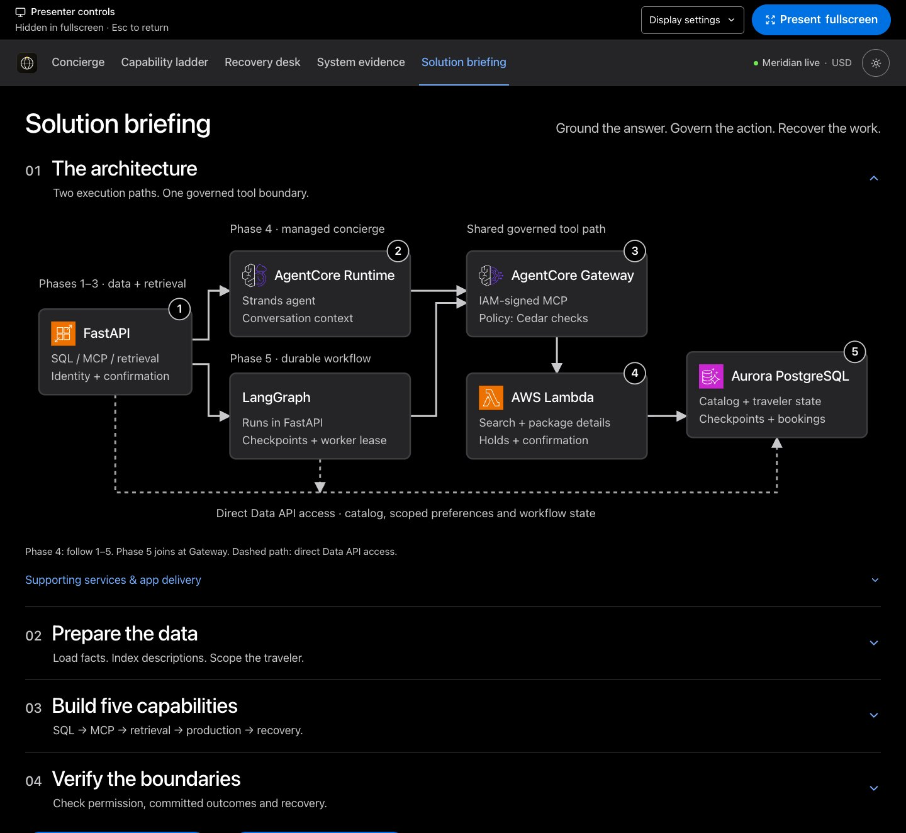
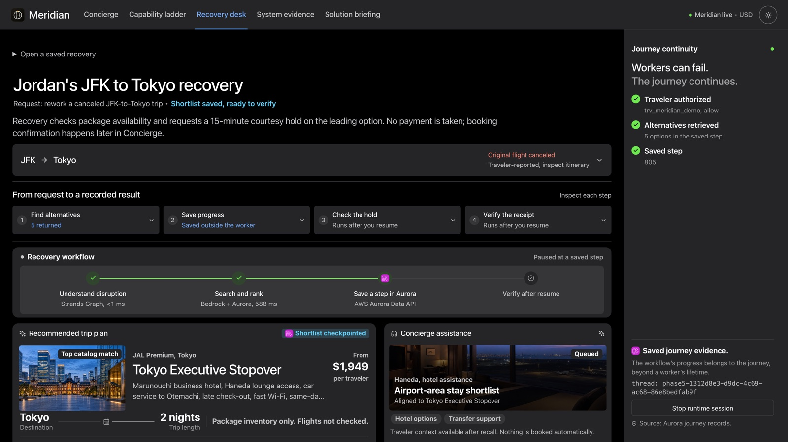

# Meridian application

Meridian is a travel concierge built on Aurora PostgreSQL, MCP, Strands Agents,
and Amazon Bedrock AgentCore. This directory holds the runnable application:
the FastAPI backend, the React frontend, the AgentCore project with its two
Runtimes, the CDK apps, scripts and tests. The maintained LangGraph example is
in [examples/langgraph](examples/langgraph/README.md); the application does not
import it.

Start with the [repository README](../README.md) for prerequisites, the quick
start and a walkthrough of the showcase. This page is the reference for the views,
phases, API, configuration, schema and governance model.

## Views

The frontend serves one primary surface at `/showcase`; `/` redirects to it and
`/device-showcase` is an alias. The selected view and journey are kept in the
URL, so a reload restores a saved workflow.

| View | Route | Contents |
| --- | --- | --- |
| Concierge | `/showcase?view=concierge` | Trip discovery, conversation with the Phase 4 runtime, trip details, holds and confirmation, and the traveler brief |
| Capability ladder | `/showcase?view=ladder` | The five phases, suggested prompts, and a trace of each reply |
| Recovery desk | `/showcase?view=recovery` | The canceled-trip workflow: saved shortlist, resume, the 15-minute hold receipt, and the handoff back to Concierge |
| System evidence | `/showcase?view=proof` | Aurora readback of the selected journey's snapshots, executions, leases, session stops, authorization decisions and holds |
| Solution briefing | `/showcase?view=briefing` | Architecture, data preparation, phase diagrams, gateway tools and Cedar policies; makes no service calls |

Concierge presents live trip options beside the conversation. **View travel brief**
reveals saved context; unset dates stay distinct from remembered target dates.
The Capability ladder exposes the activity trace for the selected phase. Expand
a step to see its events and technical payloads. **Inspect evidence** holds the
SQL, memory and policy views, and **Run RLS probe** runs the live row-level
security diagnostic.



### Display options

`/showcase?present=1` opens a dark layout with larger text for a projector or
shared screen; add `&theme=light` or `&theme=dark` to choose the theme. In the
windowed layout, the controls bar has a **Display settings** menu with a
**Projector readability** checkbox and **Preview audience layout**, and a
**Present fullscreen** button that hides the controls until you press **Esc**.
Both themes use the same color roles and system font. The
projector setting enlarges type by 20% without changing colors. Dark mode uses
the deck's black background and white labels. Rounded blue actions with white text
are shared across all five views. Green indicates observed success, red indicates
errors or blocked/canceled states, and amber indicates caution or pending attention;
labels and icons preserve the meaning without color. Unrun or unknown stays neutral.

Solution Briefing opens with the architecture. Its four numbered topics reveal
one at a time; supporting services and technical reference stay collapsed until
you open them. This keeps the projector focused on the topic being discussed.

## Five capabilities

| Phase | Capability | What the trace shows |
| --- | --- | --- |
| 1. SQL | Query | Rows from Aurora through parameterized RDS Data API filters |
| 2. MCP | Tools | Aurora access through the PostgreSQL MCP server, plus custom tools for package comparison, currency conversion, destination price range, loyalty and availability |
| 3. Retrieval | Intent | Hybrid pgvector and full-text candidates reranked by Cohere Rerank 3.5, with a Strands supervisor routing to specialists |
| 4. Production | Trust | AgentCore Runtime with four Gateway tools, a Cedar decision for each call, traveler grants and RLS scoping the data, and hold and booking receipts |
| 5. Workflow | Durability | A Strands Graph in its own AgentCore Runtime, Aurora snapshots, a worker lease, same-session resume on a new microVM, and a hold that keeps its request ID, booking ID and expiry |

### Prompts

Each phase has two example prompts that work there and a hand-off prompt
that needs the next phase. **Continue in** carries the question forward.
Phase 5 is the last phase, so its hand-off is
`Resume workflow from the saved step`. The prompts are defined once in
`backend/demo_prompts.py`.

| Phase | Works here | Needs the next phase |
| --- | --- | --- |
| SQL | `Show me city trips under $2,000 per traveler.`<br>`Show me beach trips under $2,500 per traveler.` | `Compare three trip types and convert each price to euros.` |
| MCP | `Compare three trip types and convert each price to euros.`<br>`What is the price range for Tokyo trips?` | `Find a quiet, romantic wine-country retreat with a private villa.` |
| Retrieval | `Find a quiet, romantic wine-country retreat with a private villa.`<br>`Which trip lengths are still available for Tuscany Wine & Wellness?` | `Recall my Tokyo plan and saved preferences: home airport, food needs, and budget.` |
| Production | `Find Tokyo trips that fit my saved preferences.`<br>`Recall my Tokyo plan and saved preferences: home airport, food needs, and budget.` | `My JFK-to-Tokyo flight was canceled. Rework the trip, then check duration availability for the best three options.` |
| Workflow | `My JFK-to-Tokyo flight was canceled. Rework the trip, then check duration availability for the best three options.`<br>`Which trip lengths are still available for Amalfi Coast Villa Week?` | `Resume workflow from the saved step`, after the run pauses |

These boundaries belong to the configured phases, not to SQL or MCP in
general.

Phase 4's **Use traveler context** switch applies to every Production turn,
including availability questions. With it off, the turn stops before reading or
writing traveler memory. With it on, the managed runtime handles the turn.

Phase 3's Booking Agent only estimates prices. Neither it nor the reference SQL
agent can write a booking, and the retrieval supervisor refuses write
delegation. Every hold and confirmation uses the governed Gateway path.

### Where state lives

| State | Store | Access path |
| --- | --- | --- |
| Traveler profile, preferences, conversation history and audit | Aurora PostgreSQL | RDS Data API |
| Runtime session and semantic context across turns | AgentCore Memory | AgentCore APIs, through the runtime's Strands session manager |
| Workflow state: Strands Graph snapshots, append-only JSONB, one row per node | Aurora PostgreSQL table `workflow_snapshots` | Written and read by the `MeridianWorkflow` Runtime as the `meridian_workflow` login, with the traveler pinned per transaction under RLS |
| Journey binding, worker leases and hold-request identities | Aurora PostgreSQL | Scoped RDS Data API transactions |
| Presenter session stops | Aurora PostgreSQL table `workflow_session_stops` | `POST /api/journeys/{journey_id}/stop-session`, read back under RLS |
| Holds from any phase and from the Phase 5 workflow | Aurora PostgreSQL | Gateway tool, Cedar policy, then the `MeridianHolds` Lambda in one scoped Data API transaction |
| Booking confirmation | Aurora PostgreSQL | Gateway tool, Cedar policy, then the `MeridianHolds` Lambda changing the booking from `held` to `confirmed` |

A Data API transaction keeps the RLS role and traveler scope together for one
unit of work; it is not long-lived workflow state. See
[docs/STATEFUL_ARCHITECTURE.md](docs/STATEFUL_ARCHITECTURE.md).



## Recovery behavior

The canceled-flight prompt runs `classify → search → availability →
prepare_hold → hold → synthesize` as a Strands Graph in the `MeridianWorkflow`
Runtime. It pauses after `search` so the saved snapshot is visible before the
workflow checks availability and places a hold. The hold needs the traveler's
answered review, and a resume stops again at the confirm gate until it is answered. The proof scripts pause by passing `pause_after` to the runner.

- `prepare_hold` saves the hold's request ID and booking ID in the snapshot
  before the `hold` node calls the Gateway. A resumed or retried run sends the
  same IDs, and Aurora returns the existing booking instead of creating another.
- The `MeridianHolds` Lambda checks the worker's lease inside the write
  transaction, so a worker that lost its lease cannot write.
- A snapshot and a business write are separate transactions. The design makes
  the write idempotent and the execution resumable; it does not claim
  exactly-once execution.
- The closing message comes from saved state, including the hold outcome and
  expiry, without another model rewrite.
- Saving a shortlist does not hold inventory. The hold receipt shows the
  database creation time, the 15-minute expiry and the time remaining.
- **Take it back to Jordan** carries the recorded duration, party, unit price and
  total into Concierge for confirmation.

[docs/OPERATIONS.md](docs/OPERATIONS.md#exercise-recovery-failures) describes
scripts that kill a worker, or discard a committed Gateway response, against
real Aurora and Gateway calls.

### Slow responses and reloads

The main Concierge streams AgentCore text as it arrives, with progress messages
during tool work. The final trip list and completion state appear after catalog
hydration and memory persistence. Interrupted text is marked incomplete.

- The browser stops waiting for chat, hold and confirmation responses after
  55 seconds (two minutes for the streamed Concierge) and offers **Stop waiting** before then. A server action can still
  finish after the browser stops waiting.
- The runtime client uses a 45-second socket read timeout and no blanket
  retries. An unconfirmed chat turn gets one retry if the connection closes
  before response headers arrive; holds, confirmations and timeouts are never
  retried automatically.
- For an uncertain recovery outcome, **Re-read this recovery** reads the saved
  thread before you resume it. **Open a saved recovery** selects an earlier run.
- Before sending a direct 12-hour hold, the browser stores the hold's intent ID
  and terms. A reload or retry reads that intent from Aurora under the
  traveler's RLS scope before writing anything. If browser storage is blocked,
  the app does not send a new direct hold.
- Booking confirmation reads the booking first; an already confirmed booking
  shows its receipt without confirming again.

## API

| Method | Path | Description |
| --- | --- | --- |
| `POST` | `/api/chat/stream` | Phase 4 Concierge SSE: progress, text deltas, conversation identity, then one completed response. Uses the same authentication and traveler authorization as chat. Disconnects are never automatically retried. |
| `POST` | `/api/chat` | Chat by `phase` (1 to 5). Phase 5 invokes the `MeridianWorkflow` Runtime with the conversation, traveler count and resume request, and relays its result. The response includes the trace in `activities`. |
| `POST` | `/api/chat/order` | Courtesy hold from any phase: Runtime, Gateway and Cedar, then the `MeridianHolds` Lambda. `order` is null when the hold is refused. |
| `POST` | `/api/chat/book` | Confirm a held booking. The backend reads the total under RLS so the policy judges what Aurora holds. `order` is null when the confirmation is refused. |
| `GET` | `/api/chat/holds` | Read a direct-hold receipt by `conversation_id`, `product_id`, `duration` and `quantity`; no model call or write |
| `GET` | `/api/chat/bookings/{booking_id}` | Read a booking with its amounts and expiry |
| `GET` | `/api/journeys` | List the traveler's journeys; `thread_id` selects one workflow and `limit` is 1 to 50 |
| `GET` | `/api/journeys/{journey_id}` | Saved workflow, snapshot, executions, authorization, session stops and hold evidence |
| `POST` | `/api/journeys/{journey_id}/stop-session` | Stop the journey's `MeridianWorkflow` Runtime session, record the stop in `workflow_session_stops` and release a running lease. 403 when the traveler grant is denied, 404 when the journey is not the traveler's, 409 when nothing is paused or running or the session was already stopped, 503 when the Runtime is not configured or the stop failed |
| `GET` | `/api/memory/{traveler_id}` | Traveler profile and preference facts |
| `PATCH` | `/api/memory/{traveler_id}/facts/{preference_key}` | Set the value of one preference fact under RLS |
| `DELETE` | `/api/memory/{traveler_id}/facts/{preference_key}` | Delete one preference fact under RLS |
| `GET` | `/api/packages` | Trip catalog |
| `GET` | `/api/packages/{package_id}` | One trip package; 404 when it does not exist |
| `GET` | `/api/products` | The same catalog in the frontend's product shape |
| `GET` | `/api/products/{product_id}` | One trip in the product shape (`product_id` is the `package_id`) |
| `POST` | `/api/diagnostics/rls-probe` | Allow and deny checks plus row counts under the restricted RLS role |
| `POST` | `/api/diagnostics/session-receipt` | Counts the durable rows this session produced in the last `window_minutes`, table by table |
| `GET` | `/api/health` | Checks that `workflow_snapshots` and `workflow_session_stops` exist (one query) and reports `healthy` or `degraded` (`aurora_reachable`, `degraded_component`, `degraded_error_class`), plus the workflow snapshot store, whether it is durable, and whether the workflow Runtime ARN is configured (`workflow_runtime_configured`) |
| `GET` | `/health` | Public process liveness only; it does not check Aurora |
| `GET` | `/openapi.json`, `/docs`, `/redoc` | API schema and interactive documentation |

Every route except `/health` requires the HTTP principal described under
[Governance boundary](#governance-boundary).

## Configuration

`.env.example` documents the settings below and more. The main ones:

| Variable | Purpose |
| --- | --- |
| `AWS_DEFAULT_REGION`, `BEDROCK_REGION` | AWS SDK and Bedrock Region |
| `BEDROCK_MODEL_ID` | Model for the local Strands agents (the managed concierge is configured separately). Default: `us.openai.gpt-6-sol` |
| `EMBEDDING_MODEL`, `EMBEDDING_DIMENSION` | Default `cohere.embed-v4:0` at 1024 dimensions, matching the pgvector columns |
| `AURORA_CLUSTER_ARN`, `AURORA_SECRET_ARN`, `AURORA_DATABASE` | RDS Data API connection |
| `RLS_APP_ROLE` | Restricted role for scoped sessions. Default `meridian_app` |
| `AGENTCORE_*` | Runtime, Gateway and Memory identifiers, written by `scripts/sync_agentcore_env.py` |
| `MERIDIAN_DEFAULT_BUDGET_CEILING_CENTS` | Whole-trip ceiling for Cedar when the traveler has no saved budget. Default `400000` |
| `AGENTCORE_WORKFLOW_RUNTIME_ARN` | ARN of the `MeridianWorkflow` Runtime that runs Phase 5. `scripts/sync_agentcore_env.py --write` sets it |
| `AURORA_WORKFLOW_SECRET_ARN` | Secret for the `meridian_workflow` login, written by `scripts/provision_workflow_login.py --write-env` |
| `MERIDIAN_API_TOKEN`, `CORS_ORIGINS` | API token and allowed origins for any non-loopback deployment |

`requirements.in` lists the direct Python dependencies and `requirements.txt`
is the hash-pinned lock, including PostgreSQL MCP server 1.0.9. Both Phase 2
clients start that installed module with the active interpreter, so no package
is downloaded during a request. To regenerate the lock with `uv`:

```bash
uv pip compile --generate-hashes --output-file requirements.txt requirements.in
```

## Aurora schema

`backend/db/schema.sql` creates the core tables:

- `trip_packages`: the catalog, with `embedding vector(1024)` and a generated `search_vector`
- `travelers`, `traveler_profiles`, `traveler_preferences`: traveler profile and long-term memory
- `traveler_identity_bindings`, `traveler_access_audit`: workload-to-traveler grants and allow and deny records
- `conversations`, `conversation_messages`, `trip_interactions`: session history and semantic recall
- `bookings`, `booking_lines`, `agent_traces`: bookings and agent observability

`examples/rls_for_agents.sql` adds the RLS policies and the Phase 4 audit trail: the
`agent_audit_log` table (identity, RLS scope and rows returned) and the `agent_iam_audit`
view over it. Migration `005_bind_identity_to_traveler.sql` adds the authorization
columns to that table and recreates the view.

The migrations in `scripts/migrations/` add the journey, execution, hold
request, snapshot and session-stop tables (`journeys`, `journey_executions`,
`hold_requests`, `workflow_snapshots`, `workflow_session_stops`), the
`meridian_workflow` login role,
`bookings.confirmed_at`, and the two `SECURITY DEFINER` functions the governed
writes call: `create_courtesy_hold` and `confirm_booking`. Both re-check the
traveler scope and agent type inside the transaction, and a retried call
returns the original booking or confirmation. `scripts/apply_migrations.py`
applies them to new and existing databases.

`scripts/travel_catalog.py` defines the seed data and `scripts/seed_data.py`
loads it with its Cohere Embed v4 vectors. After changing the catalog, run
`python scripts/seed_data.py --catalog-only` to update packages without
touching travelers, bookings, grants or journeys.

Each package has its own image at `frontend/public/travel/catalog/<package_id>.jpg`,
and `travel_catalog.py` derives `image_url` from the package ID. To replace the
images, put new files named after their package IDs in a folder and run:

```bash
python scripts/install_catalog_images.py ~/Downloads/meridian-art --backup ~/art-backup
```

The script crops and resizes each image and reports packages without artwork.

## Governance boundary

The HTTP layer binds each request to a traveler before workload authorization
runs. Loopback development (the default `ENVIRONMENT=development`) and the
hosted sample use one shared principal; neither authenticates Jordan as a
person. Set `MERIDIAN_API_TOKEN` and `CORS_ORIGINS` before exposing the API to
a network.

Traveler-scoped operations and gateway actions pass these controls:

1. AWS STS or AgentCore Identity authenticates the workload.
2. `traveler_identity_bindings` in Aurora authorizes that workload for the requested traveler. A missing grant fails before any RLS scope is set.
3. Aurora row-level security filters rows to that traveler under the restricted `meridian_app` role.
4. AgentCore Gateway serves the tools over MCP with SigV4, and its Cedar policy engine (`MeridianGovernance`, `ENFORCE` mode) decides each tool call on its arguments before a Lambda runs. Reads are permitted. A courtesy hold is permitted only when the traveler confirmed it, for at most 12 hours and 6 travelers, within the traveler's saved budget ceiling. A confirmation is permitted only when the traveler confirmed it and the total is within that ceiling. Any other call is denied by default.
5. The `MeridianHolds` Lambda is a workload with its own grant. It sets the traveler scope, switches to `meridian_app`, and calls `create_courtesy_hold` or `confirm_booking`. The Phase 4 concierge and the Phase 5 workflow both place holds through this tool; the workflow also passes its request ID, booking ID and execution ID so the Lambda can check the worker's lease.

The runtime pins the traveler ID, the confirmation flag, the budget ceiling and
the journey reference on every hold and confirmation call from the request the
backend authorized, so the model cannot confirm for the traveler or change the
ceiling. The ceiling is the traveler's saved per-person budget multiplied by
the party size, the same figure the travel brief and confirmation dialog show.
Allow and deny decisions are written to `traveler_access_audit`, and completed
turns link the authorization subject to the RLS scope in `agent_iam_audit`.

Missing AgentCore configuration fails closed. IAM and target failures are
reported where they happen, not as Cedar denials.

An application with real users must authenticate each user and bind the
verified user identity, such as an Amazon Cognito `sub`, to the traveler,
instead of treating one workload as every user.

### Cedar and Dogwood

The Cedar policies are in
[`meridian_agentcore/agentcore/agentcore.template.json`](meridian_agentcore/agentcore/agentcore.template.json).
[docs/DOGWOOD_POLICY_ASSESSMENT.md](docs/DOGWOOD_POLICY_ASSESSMENT.md) assesses
adding a Dogwood temporal policy that requires a recent lookup of the same
package before a hold. It is not enabled.

## Tech stack

| Layer | Technology |
| --- | --- |
| Frontend | React 18, Vite, TypeScript |
| Backend | FastAPI, Python 3.13 |
| Agents | Strands Agents for Phases 1 to 4; the Phase 4 agent runs on AgentCore Runtime with tools from AgentCore Gateway |
| Workflow | Strands 1.57.2 Graph on its own AgentCore Runtime, `MeridianWorkflow`, with Aurora snapshots and worker leases. The LangGraph version is in `examples/langgraph/` |
| Governance | AgentCore Policy (Cedar, `ENFORCE`), workload grants in Aurora, row-level security |
| Database | Aurora PostgreSQL, RDS Data API, pgvector HNSW |
| Models | Managed concierge and local agents: GPT-6 Sol (`us.openai.gpt-6-sol`), each configurable through `BEDROCK_MODEL_ID`. Cohere Embed v4 (`cohere.embed-v4:0`) and Cohere Rerank 3.5 (`cohere.rerank-v3-5:0`) on Amazon Bedrock |
| MCP | `awslabs.postgres-mcp-server` and the custom `meridian-concierge` and `meridian-memory` servers |
| Observability | AWS Distro for OpenTelemetry on the runtime; spans and logs in the runtime's CloudWatch log group, with the trace ID shown in the UI |

## Documentation

Start with the [documentation index](docs/README.md), the
[numbered capability guides](backend/agents/README.md), or the
[60-minute presenter run of show](docs/TALK_RUN_OF_SHOW.md).

| Document | Contents |
| --- | --- |
| [STRUCTURE.md](STRUCTURE.md) | The request path through the code and a directory map |
| [docs/STATEFUL_ARCHITECTURE.md](docs/STATEFUL_ARCHITECTURE.md) | Where each kind of state lives and how it is reached |
| [docs/CODE_WALKTHROUGH.md](docs/CODE_WALKTHROUGH.md) | A guided tour of the source, phase by phase |
| [docs/AGENTCORE_DEPLOY_RUNBOOK.md](docs/AGENTCORE_DEPLOY_RUNBOOK.md) | Deploy the AgentCore resources |
| [docs/OPERATIONS.md](docs/OPERATIONS.md) | Provision Aurora, run the workflow Runtime, exercise recovery, publish the web app, troubleshoot |
| [docs/AGENTCORE_LEARNINGS.md](docs/AGENTCORE_LEARNINGS.md) | AgentCore, Cedar and App Runner behavior that shaped the code |
| [docs/DOGWOOD_POLICY_ASSESSMENT.md](docs/DOGWOOD_POLICY_ASSESSMENT.md) | Design for an optional temporal policy |
| [meridian_agentcore/README.md](meridian_agentcore/README.md) | The AgentCore CLI project and its configuration templates |
| [backend/agents/README.md](backend/agents/README.md) | The agent modules for each phase |
